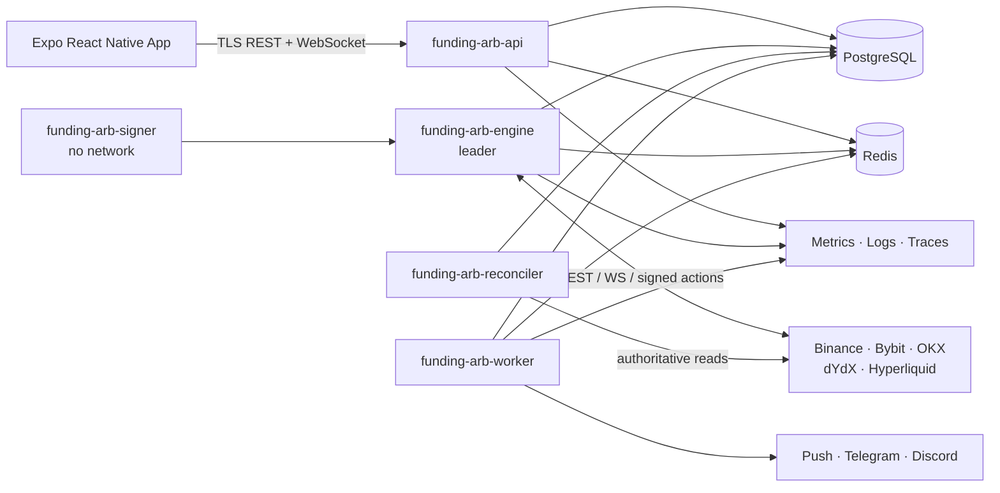

# Perpeto

## Funding Rate Arbitrage Platform — Product and Engineering Specification

| Field | Value |
|---|---|
| Product name | **Perpeto** (working public name; complete trademark, domain, app-store and social-handle clearance before commercial release) |
| Mobile display name | **Perpeto** |
| Internal technical slug | `funding-arb` (stable and independent of the eventual public name) |
| Document version | 1.0 |
| Status | Implementation specification |
| Last updated | 2026-07-13 |
| Delivery model | One isolated private deployment per client |
| Backend | Rust |
| Mobile client | React Native with Expo, iOS and Android |
| Initial venues | Binance, Bybit, OKX, dYdX, Hyperliquid |
| Deployment | Docker Compose on a low-latency VPS |

**Brand direction:** **Perpeto** is named for the *perpetual* futures it trades and the continuous funding **carry** it captures. It positions the product as a disciplined, market-neutral system that discovers funding-rate opportunities and holds controlled two-leg (spot–perpetual and perpetual–perpetual) positions. The brand line is *The perpetual edge.* Continuity and balance are the visual and operational themes, not promises of atomic cross-venue fills, guaranteed latency, neutrality or profit. The internal `funding-arb` slug remains independent of the public brand.

> **Risk notice:** This system automates leveraged cryptocurrency trading. It cannot guarantee profit, funding receipt, fill quality, venue solvency, protocol safety, or uninterrupted connectivity. A delta-neutral position can still lose money through fees, basis changes, liquidations, borrow costs, stablecoin depegs, smart-contract failures, exchange outages, or faulty data. Live trading must remain disabled until every configured venue passes paper-trading and limited-capital certification. The operator is responsible for exchange eligibility, tax, licensing, sanctions, and other legal obligations in every applicable jurisdiction.

---

## 1. Executive summary

The product is a private, production-grade system that discovers, opens, manages, and closes market-neutral funding-rate arbitrage positions. It supports:

1. **Spot versus perpetual:** normally long spot and short a positive-funding perpetual; reverse cash-and-carry is allowed only when a connector confirms short-borrow inventory and cost.
2. **Perpetual versus perpetual:** long the leg with the cheaper funding obligation and short the leg with the richer funding receipt, either across venues or between compatible products on one venue.

The execution engine runs on a VPS close to the chosen exchange endpoints. The mobile application is an operations, monitoring, configuration, and approval client; it never runs trading logic or stores exchange credentials.

The first release integrates Binance, Bybit, OKX, dYdX, and Hyperliquid through a normalized adapter layer. CEX spot and linear stablecoin-settled perpetuals are in scope. dYdX and Hyperliquid provide perpetual legs in v1. Inverse contracts, dated futures, options, and DEX spot are extension points, not v1 trading instruments.

### 1.1 Product goals

- Continuously rank executable opportunities by conservative **net** return, not headline funding rate.
- Coordinate both legs with bounded residual delta and deterministic recovery from partial fills or timeouts.
- Account for actual account-tier fees, expected slippage, spread, borrow, gas, and exit costs.
- Keep a durable, auditable record of every decision, order intent, fill, funding payment, risk event, and operator action.
- Protect capital with layered pre-trade, in-trade, venue, portfolio, and operational controls.
- Provide clear mobile visibility into opportunity quality, current risk, realized PnL, system health, and actions requiring approval.
- Support isolated repeatable deployments for different clients without implementing shared SaaS tenancy.

### 1.2 Non-goals for v1

- Directional trading, market making, options arbitrage, dated-futures basis trading, or statistical pairs trading.
- Custody of third-party customer money or a shared multi-tenant trading service.
- Latency-sensitive co-location or high-frequency trading guarantees.
- Automatic CEX withdrawals. CEX credentials must not have withdrawal permission.
- Telegram or Discord trade commands. Those channels are notifications only.
- Server-signed external on-chain capital movement; the Owner uses an external wallet after proposal approval.
- Profit guarantees or tax/regulatory reporting beyond exportable records.

### 1.3 Success criteria

- A qualified opportunity can be paper-traded or live-traded through the same engine and state machine.
- A process restart, WebSocket reconnect, duplicate message, or ambiguous order response cannot create duplicate orders.
- The engine detects and bounds unmatched exposure using configured notional and time limits.
- PnL reconciles to venue fills, fees, funding ledgers, borrow charges, gas, and marked open positions.
- Every configured exchange exposes current connection health, market-data age, rate-limit budget, clock drift, balances, orders, and positions.
- An operator can understand and control the complete system from iOS or Android, including an emergency global trading halt.

---

## 2. Users, roles, and operating model

Each deployment represents one organization and one trading portfolio. It may contain multiple users but shares no runtime, database, secrets, or infrastructure with another client.

| Role | Permissions |
|---|---|
| Owner | Full configuration, user/device management, credential management, live-mode enablement, approvals, trading, audit export |
| Trader | View all trading data; create, pause, resume, and close strategies within assigned limits; cannot reveal or replace secrets |
| Approver | Review and approve/reject rebalancing and high-risk actions; cannot edit strategies unless also a Trader |
| Viewer | Read-only dashboards, positions, analytics, alerts, and health |

Rules:

- The first Owner is created with a one-time bootstrap token generated by the deployment CLI and invalidated after use.
- TOTP MFA is mandatory for Owner, Trader, and Approver roles. Recovery codes are single-use and stored hashed.
- Interim exception (DEC-0009): the shared v1 backend may run with `PERPETO_OPEN_REGISTRATION` enabled, which admits each new social sign-in immediately to full access without pending approval or MFA. Version 2 isolates each user's backend and restores the gated approval and mandatory-MFA rules above.
- Biometrics only unlock a locally stored mobile refresh credential; they do not replace server-side MFA for step-up actions.
- Live-mode enablement, emergency-limit increases, secret changes, and capital-movement approvals require recent step-up authentication.
- Default approval quorum is one Owner or Approver with TOTP. A deployment may require two distinct approvers above a configured amount.

### 2.1 Core user journeys

1. Deploy the platform and bootstrap the first Owner.
2. Connect venue accounts, verify permissions, import instruments/fees, and complete a connection test.
3. Select paper mode, configure portfolio/risk defaults, and enable eligible strategy routes.
4. Observe scanner results and inspect the complete yield and risk breakdown.
5. Start a strategy manually or permit an approved strategy template to auto-enter.
6. Monitor coordinated opening, funding capture, hedge drift, PnL, and venue health.
7. Receive alerts and intervene, pause, or unwind when necessary.
8. Review a rebalancing proposal, perform any CEX withdrawal externally, or approve and externally sign an allowlisted DEX-wallet transfer.
9. Export audit, order, fill, funding, transfer, and PnL records.

---

## 3. Domain language and financial conventions

### 3.1 Glossary

| Term | Definition |
|---|---|
| Leg | One spot or perpetual position on one venue |
| Pair | Two legs intended to offset the same underlying delta |
| Funding interval | The venue-defined period ending at a funding settlement timestamp |
| Normalized funding rate | Adapter output where a positive value means longs pay shorts for that interval |
| Basis | Perpetual or spot price difference expressed in quote currency and basis points |
| Residual delta | Unmatched base-asset exposure after contract multiplier and fills are considered |
| Entry edge | Expected funding benefit minus entry/exit costs and risk buffers |
| Opportunity | A current, executable candidate route and direction |
| Strategy | Persistent rules that decide which opportunities may be traded |
| Arbitrage position | The durable lifecycle linking both legs, orders, fills, funding, and PnL |
| Reconciliation | Comparing local state with venue-authoritative orders, fills, balances, and positions |
| Paper mode | Full decision/execution simulation using live market data and deterministic simulated fills |
| Kill switch | A control that blocks new risk and optionally starts a configured unwind policy |

### 3.2 Numeric and time rules

- Use decimal arithmetic for prices, quantities, rates, fees, and money. Rust domain newtypes wrap `bigdecimal::BigDecimal`; PostgreSQL uses `NUMERIC(38,18)`. Every conversion applies an explicit instrument/asset scale and named rounding direction before risk approval. IEEE floating-point values must not enter accounting or sizing decisions.
- Store timestamps as UTC `TIMESTAMPTZ`; API timestamps use RFC 3339 with millisecond precision.
- Store venue timestamps and local receive timestamps separately to measure staleness and clock drift.
- Use UUIDv7 identifiers internally. Preserve venue order, fill, transaction, and client-order identifiers verbatim.
- Each funding observation includes its interval start/end, next settlement time, rate sign convention, source, status and input coverage. Never assume an eight-hour interval.
- The connector imports current tick size, lot size, contract multiplier, minimum notional, funding interval, margin rules, and trading status. Values are refreshed on startup and when a venue announces instrument changes.

### 3.3 Funding sign normalization

Adapters convert venue-specific values into this invariant:

```text
normalized_rate > 0  => long pays short
normalized_rate < 0  => short pays long
position_sign        => +1 for long, -1 for short
funding_cashflow     => -position_sign × adapter_funding_notional × normalized_rate
```

`adapter_funding_notional` uses the venue-defined mark, index, oracle or contract basis; it is not assumed to equal generic mark-price notional. Funding formulas, caps, settlement windows, and credits remain venue-specific. The system records the raw venue value, payment-price basis and normalized value. Strategy code must never infer payer direction directly from a raw API field.

Delta neutrality is calculated separately through exact contract metadata:

```text
net_delta_usd = Σ adapter_calculated_delta_usd(leg)
hedged = abs(net_delta_usd) <= configured_usd_limit
         AND abs(net_delta_usd) / gross_notional <= configured_bps_limit
```

---

## 4. Functional requirements

### 4.1 Venue capability matrix

| Venue | v1 spot leg | v1 perpetual leg | Market/account data | Order path | Credential/signing model | Test mode |
|---|---:|---:|---|---|---|---|
| Binance | Yes | Linear stablecoin perpetual | REST + public/private WebSocket | REST or supported trade WebSocket behind adapter | IP-allowlisted read/trade API key; withdrawals disabled | Futures/spot test environments where available, otherwise paper adapter |
| Bybit | Yes | Linear stablecoin perpetual | V5 REST + public/private WebSocket | V5 order API/trade WebSocket behind adapter | IP-allowlisted read/trade API key; withdrawals disabled | Testnet plus paper adapter |
| OKX | Yes | Linear stablecoin swap | V5 REST + public/private WebSocket | V5 order API/private WebSocket behind adapter | IP-allowlisted read/trade key + passphrase; withdrawals disabled | Demo trading plus paper adapter |
| dYdX | No | Yes | Indexer REST/WebSocket plus chain verification | Signed chain/client transaction through adapter | Dedicated limited-balance trading signer | Testnet plus paper adapter |
| Hyperliquid | No | Yes | Info API + WebSocket | Signed exchange action through adapter | Authorized API wallet/agent where supported; master wallet kept outside service | Testnet plus paper adapter |

The adapter advertises capabilities at runtime. Unsupported route combinations are never shown as executable. A connector is `CERTIFIED` only after its release gates in section 17 pass; otherwise it is `PAPER_ONLY` or `DISABLED`.

### 4.2 Supported route types

#### A. Spot–perpetual cash-and-carry

- **Positive funding:** long spot and short the perpetual.
- **Negative funding / reverse cash-and-carry:** short borrowed spot and long the perpetual. Disabled by default and eligible only when the spot connector returns borrow availability, interest rate, utilization limits, and repayment support.
- Spot and perpetual may be on the same CEX or different supported venues.
- DEX perpetuals may pair with CEX spot.

#### B. Perpetual–perpetual

- Long one perpetual and short another perpetual on the same underlying.
- Choose direction from the combined expected funding cashflow, not merely the larger absolute displayed rate.
- Support cross-exchange routes and compatible intra-exchange products exposed by an adapter.
- Match base-asset delta after contract multipliers, quote/settlement assets, and precision are applied.

#### Route eligibility

A route is excluded when any of these conditions holds:

- underlying mapping is ambiguous or contract metadata is stale;
- either market is halted, reduce-only, pre-listing, delisting, or outside configured status;
- expected funding settlement cannot be determined confidently;
- quote/stablecoin exposure is not allowlisted;
- available balance, margin, borrow, or gas is insufficient;
- depth inside the slippage cap is below required notional;
- actual account fee tier is unavailable and the conservative configured fallback makes the trade unprofitable;
- either venue/account/market-data stream is degraded;
- opening would violate portfolio, venue, asset, leverage, liquidation, or residual-delta limits;
- predicted net return falls below the strategy threshold.

### 4.3 Market and account data

The system must ingest and normalize:

- instrument metadata and trading status;
- best bid/ask and configurable order-book depth;
- trades, mark price, index price, premium/basis, open interest when available;
- current/estimated funding, funding history, interval, cap/floor, and next settlement timestamp;
- account-specific maker/taker fee schedules and any rebates;
- balances, available collateral, margin usage, positions, liquidation estimates, orders, fills, and funding/fee ledgers;
- borrow availability and interest for enabled reverse cash-and-carry routes;
- chain transaction state, gas/fees, wallet balance, and nonce/sequence for DEX venues.

WebSockets are the primary real-time path. REST/indexer/chain queries provide startup snapshots and reconciliation. Sequence gaps, checksum failures, stale snapshots, or reconnects invalidate the affected local book until a fresh snapshot and buffered deltas have been applied.

Scanning is two-stage to respect connection and rate limits: lightweight ticker/funding/instrument streams cover the broad eligible universe; the engine subscribes to full depth only for a rotating shortlist of high-potential routes plus all open/executing positions. An on-demand preview must obtain synchronized executable depth for both legs even when the candidate was not already shortlisted.

### 4.4 Funding monitor and prediction

Every active perpetual produces a `FundingForecast` containing:

```text
venue, instrument, observed_at, interval_start, interval_end,
current_estimate, predicted_settlement_rate, p10_rate, p90_rate,
direction_probability, calibration_error, sample_coverage,
model_version, input_freshness, next_funding_at
```

The v1 predictor is transparent and venue-specific rather than an opaque ML model:

1. Use the venue-published live estimate or premium formula as the primary signal.
2. Reconstruct a settlement estimate from premium/index observations when the official formula and inputs permit it.
3. Blend short-horizon observations using time-to-settlement weighting and a configurable EWMA.
4. Use recent finalized-rate errors to calibrate the `p10`–`p90` prediction interval and probability that the predicted payer direction remains unchanged.
5. Widen the interval and lower sample coverage for missing samples, formula/cap changes, volatile premium, divergent published/reconstructed estimates, stale data, or sparse history.

Model inputs and output are persisted for replay. Any later statistical/ML predictor must run in shadow mode until it beats the deterministic baseline on out-of-sample calibration and net-trade decisions.

Per-leg forecast fields describe rate uncertainty only. At opportunity level, calculate `profitability_probability = P(expected_net_pnl > 0)` by applying the joint empirical forecast residuals and configured cost uncertainty to the complete two-leg route. Calibrate it on rolling out-of-sample settlements. When fewer than 30 comparable finalized route observations exist, use a documented pooled cohort and cap it at `0.69`, below the starter live threshold. Where this document or UI says opportunity “confidence,” it means this route-level profitability probability; it never means that a venue-published estimate is guaranteed.

### 4.5 Opportunity calculation and ranking

For a horizon `H`, compute expected funding cashflow for all settlements inside the intended hold period:

```text
gross_funding = Σ(-position_sign_i × adapter_funding_notional_i,t × predicted_rate_i,t)

entry_cost = maker/taker fees + modeled spread/slippage + gas/chain fees
exit_cost  = conservative close fees + modeled spread/slippage + gas/chain fees
carry_cost = spot borrow interest + settlement/transfer costs
risk_buffer = forecast uncertainty reserve + basis/unwind reserve + configurable safety bps
modeled_basis_price_pnl = 0 by default; non-zero only for a versioned validated model

expected_net_pnl = gross_funding + modeled_basis_price_pnl
                   - entry_cost - exit_cost - carry_cost - risk_buffer
net_apr = expected_net_pnl / required_capital × (365 days / H)
```

`required_capital` includes spot purchase capital, perpetual initial margin, venue safety collateral, and gas reserve actually tied up by the route. The UI shows gross funding, every cost, expected net PnL, simple APR, optional compounded APY, and break-even funding. APY is never substituted for realized return.

Projected entry/exit prices come from full-book sweeps at the requested quantities. When those VWAPs already incorporate price impact, `modeled spread/slippage` is only the difference from the decision mid used for attribution and is not subtracted a second time. The uncertainty reserve covers adverse movement beyond the modeled caps.

The v1 default rank is deterministic and versioned: apply every eligibility/risk gate, then sort by `(net_apr DESC, profitability_probability DESC, available_capacity DESC, next_funding_at ASC, route_id ASC)`. Alternative user-selected sorts do not change eligibility. Basis volatility, concentration, liquidity, health and forecast error affect costs, reserves, capacity or hard gates rather than being hidden inside arbitrary weights. The API returns every component and `ranking_version`.

### 4.6 Scanner filters and sorting

- Route: spot–perpetual, perpetual–perpetual, same venue, cross venue.
- Venue and account allow/deny lists.
- Underlying and quote/settlement asset.
- Minimum route profitability probability, forecast coverage, and net APR.
- Maximum notional, slippage, basis, leverage, and time to next funding.
- Minimum 24-hour volume and depth within the configured bps band.
- Positive-only, negative-only, or either funding direction.
- Certified-live, paper-only, or all connectors.
- Sort by default rank, net APR, next funding, profitability probability, available capacity, or expected PnL.

Results update in real time and carry a freshness timestamp. Selecting a result produces a new executable quote; the list row itself is never treated as an orderable price.

### 4.7 Strategy configuration

Each strategy includes:

- name, enabled state, paper/live mode, route type, allowed venues/assets;
- entry net-APR threshold, route profitability-probability threshold, minimum forecast coverage, minimum time-to-funding, and maximum basis;
- capital allocation method: fixed notional, percent of free equity, or bounded dynamic sizing;
- maximum concurrent positions and cooldown after exit/failure;
- execution policy and timeouts;
- hold policy: one settlement, fixed duration, or remain while net forecast exceeds exit threshold;
- auto-compounding policy and minimum reinvest amount;
- exit, rate-flip, take-profit, stop-loss, drawdown, and emergency rules;
- strategy-specific limits that may only be stricter than organization hard limits;
- version, creator, approver when required, and full configuration history.

Editing a running strategy creates a version. Changes affect new entries immediately; changes to existing positions require an explicit `apply_to_open_positions` action and audit event.

### 4.8 Simulation and backtesting

The same strategy, predictor, cost, sizing and risk code runs in replay, paper and live modes through different clock and execution adapters.

- Replay normalized funding observations, finalized settlements, order-book/depth samples, instrument versions, fees, borrow rates and venue health in event-time order.
- Prevent look-ahead: a strategy sees only data whose receive timestamp is at or before the simulated clock.
- Simulated execution walks recorded books, applies configured latency, queue/fill assumptions, partial fills, fees, funding eligibility and adverse price caps.
- When complete depth or account-tier fees are unavailable, mark the run `LOW_FIDELITY` and use conservative assumptions rather than silently imputing ideal fills.
- Support deterministic seeds, parameter sweeps, walk-forward validation and an untouched out-of-sample period.
- Output opportunities considered/skipped, paired executions, residual delta, gross funding, every cost/PnL component, utilization, drawdown, liquidation stress, prediction calibration and failure count.
- Persist the code/config/data versions and content hashes so a result can be reproduced.
- A backtest can qualify a strategy for paper mode but never bypass venue shadow/pilot certification.

---

## 5. Coordinated execution engine

### 5.1 Core guarantee

Cross-venue execution is never atomic. The platform guarantees durable intent, bounded attempts, continuous exposure measurement, and deterministic recovery—not simultaneous fills.

All opens, re-hedges, and closes use price-capped limit/IOC orders. Uncapped market orders are prohibited. Every request carries a deterministic client order ID derived from the execution and attempt, for example `fa-{execution_short_id}-{open|close|hedge}-{leg}-{attempt}`. The adapter fits this to venue length/character rules with a stored collision-resistant hash; a timeout is queried by that ID before a retry is allowed.

### 5.2 Position lifecycle

```text
DISCOVERED -> QUALIFIED -> RESERVED -> OPENING -> OPEN
                                  \-> OPEN_FAILED -> RECOVERING -> CLOSED/OPEN
OPEN -> REHEDGING -> OPEN
OPEN -> EXIT_QUEUED -> CLOSING -> CLOSED
OPEN/CLOSING -> EMERGENCY_UNWIND -> CLOSED/MANUAL_INTERVENTION
any non-terminal state -> PAUSED when authoritative state cannot be established
```

Transitions are persisted transactionally and validated by a state machine. Terminal records are immutable except for later ledger reconciliation annotations.

### 5.3 Preflight sequence

1. Acquire a portfolio/risk reservation and per-route lock.
2. Confirm the engine is leader, live mode is armed, clocks are synchronized, and kill switches are clear.
3. Refresh balances, open orders, positions, fee tier, instrument filters, margin mode, leverage, and DEX nonce/sequence.
4. Capture synchronized executable depth snapshots; reject stale or crossed books.
5. Compute precision-safe quantities and expected residual delta.
6. Simulate worst-case fees, slippage, partial fill, margin, liquidation buffer, and exit cost.
7. Re-evaluate the net threshold using current executable prices.
8. Persist the immutable execution plan, risk decision, order intents, and correlation IDs.
9. Submit only if all checks pass; release the reservation on rejection.

### 5.4 Execution policies

| Policy | Behavior | Use |
|---|---|---|
| `TAKER_BOTH` | Submit marketable IOC limit orders concurrently on both legs within price caps | Default safety policy when expected net return survives taker fees |
| `MAKER_THEN_HEDGE` | Post on the selected liquid leg; hedge each confirmed fill immediately with capped IOC on the other leg | Fee-sensitive opportunities with enough time and depth |
| `ADAPTIVE` | Choose `TAKER_BOTH` when profitable; otherwise use `MAKER_THEN_HEDGE` only if its exposure limits pass | Default strategy-level policy |

Paired post-only orders without fill-triggered hedging are not supported in v1.

### 5.5 Opening algorithm

1. Submit the two `TAKER_BOTH` legs concurrently with `tokio::join!`, or submit the maker leg for `MAKER_THEN_HEDGE`.
2. Consume private order/fill streams and update filled base delta per fill.
3. For maker-first execution, immediately submit an opposing capped IOC hedge for each accumulated fill slice above the venue minimum.
4. If one taker leg fills more than the other, cancel any remaining excess intent and hedge the unmatched amount on the most liquid eligible leg.
5. Retry only the known unfilled quantity, within maximum attempts, slippage, time, and notional limits.
6. If the imbalance deadline or loss cap is reached, cancel all open orders and execute the configured recovery: complete hedge, flatten filled leg, or stop for manual intervention.
7. Mark `OPEN` only after venue reconciliation confirms orders, fills, positions, and residual delta within tolerance.

Closing follows the same algorithm with reduce-only perpetual orders wherever the venue supports them. Spot sell quantities are bounded by owned free balance. The system must not accidentally reverse a leg.

### 5.6 Ambiguous outcomes and idempotency

- Persist order intent before network submission.
- A transport timeout means `UNKNOWN`, not `REJECTED`.
- Query open orders, order-by-client-ID, fills, position, and account ledger before retrying an unknown order.
- Deduplicate inbound events by venue event/fill ID plus account; tolerate reordered and repeated messages.
- Use a transactional outbox for domain events and notifications.
- Reconcile all non-terminal executions on startup before enabling new entries.
- If a venue cannot provide authoritative status, freeze new risk on that venue and alert an operator.
- Gate every submit/cancel/amend/borrow/internal-transfer call on the currently held PostgreSQL leader epoch. Renew the 10-second lease at least every 3 seconds and stop new side effects when renewal fails or less than 2 seconds remain. A successor waits expiry, obtains a higher epoch and reconciles before sending anything. Because an already transmitted CEX request cannot be fenced, its outcome remains unknown until reconciled.

Connector submission errors have exactly four categories:

| Category | Meaning | Coordinator action |
|---|---|---|
| `REJECTED` | Venue confirms no order exists | Correct only an explicitly safe cause or enter recovery |
| `RETRYABLE_BEFORE_SUBMISSION` | Local validation/transport proves bytes were not submitted | Retry the known remaining amount within policy |
| `UNKNOWN_OUTCOME` | Timeout, disconnect or server error after possible submission | Query by client ID, fills and position before any retry |
| `FATAL_CONFIGURATION` | Permission, signer, position mode, account or unsupported-rule problem | Freeze affected connector and require remediation |

### 5.7 Re-hedging

Residual delta is calculated in base units and quote notional using current conservative prices. Re-hedge only when both a notional threshold and persistence duration are exceeded, preventing fee-heavy oscillation. Re-hedging uses the lower-cost eligible leg unless liquidation risk, venue health, borrow availability, or position constraints require the other leg.

### 5.8 Funding capture and exit

- Confirm the position was open during the venue-defined eligibility window; do not infer receipt solely from timestamp proximity.
- Import actual funding ledger entries and tie each to its leg and settlement.
- Recompute hold-versus-exit after every funding forecast, cost, margin, or health change.
- Trigger normal exit when expected future net return drops below the strategy exit threshold.
- Trigger accelerated exit when funding flips beyond tolerance, forecast coverage/calibration fails or route profitability probability collapses, basis/liquidation risk breaches limits, or a venue becomes unhealthy.
- If immediate two-leg close is unsafe, first neutralize delta on a healthy venue, then unwind the impaired leg under the incident runbook.

---

## 6. Risk management

### 6.1 Risk hierarchy

Hard organization limits cannot be overridden from the mobile app without Owner step-up authentication and an audit event. Strategy limits may only be equal or stricter. The risk engine evaluates projected state, including all open orders and reserved capital, not only filled positions.

### 6.2 Safe starter defaults

These defaults are deployment templates, not trading advice. Live mode stays locked until the Owner reviews them.

| Control | Starter default |
|---|---:|
| Maximum deployed portfolio capital | 70% of net equity |
| Maximum one opportunity | 10% of net equity |
| Maximum one underlying | 20% of net equity |
| Maximum one venue | 35% of net equity |
| Maximum leverage on any perpetual leg | 2.0× |
| Minimum liquidation-distance buffer | 20% mark-price distance, plus venue stress check |
| Minimum route profitability probability | 0.70 |
| Minimum expected net APR | 15% |
| Minimum depth inside slippage cap | 5× proposed leg notional |
| Major-asset slippage cap | 10 bps per leg |
| Other allowlisted asset slippage cap | 25 bps per leg |
| Maximum entry basis magnitude | 100 bps unless backtested override |
| Maximum unmatched exposure | Lesser of USD 1,000 or 0.5% of equity |
| Maximum imbalance duration | 2 seconds before forced recovery |
| Delta re-hedge threshold | Greater of USD 100 and 5 bps of position notional, persistent 3 seconds |
| Maximum daily realized loss | 2% of start-of-day equity; then halt new entries |
| Maximum peak-to-trough portfolio drawdown | 5%; then global halt and manual review |
| Executable quote/book maximum age | 1 second; connector may be stricter |
| Feed liveness | Valid session heartbeat and synchronized book; connector-specific timeout, never inferred only from last market change |
| Clock drift | Warn at 100 ms; block new orders at 250 ms |
| Entry attempts | 3 bounded attempts per leg |
| Normal order execution deadline | 5 seconds total |

All currency amounts are configurable in the deployment base currency. A user must explicitly acknowledge changed starter defaults before live arming.

### 6.3 Pre-trade controls

- Validate instrument status, precision, minimum/maximum size, price bands, leverage, position mode, and reduce-only semantics.
- Use account-specific maker/taker fees; apply the worse fee when order role is uncertain.
- Stress entry and immediate exit at slippage caps, plus a configurable basis shock.
- Require free collateral after the trade to exceed venue and portfolio buffers.
- Include all resting orders and pending transfer reservations in exposure.
- Check stablecoin, chain, venue, and underlying concentration.
- Require adequate gas/native token on DEX signing wallets.
- Reject duplicate routes on the same underlying unless the combined risk is explicitly allowed.

### 6.4 Runtime controls

- Continuously track delta, basis, margin utilization, liquidation distance, funding forecast, borrow cost, available collateral, and venue health.
- Cancel stale opening/passive-maker orders and opening orders that no longer satisfy the strategy threshold. Hedge, reduce-only, close and emergency orders follow their own risk/recovery policies and are never cancelled solely because expected yield fell.
- Halt new orders on sequence gaps, invalid books, repeated authentication errors, rate-limit exhaustion, excessive clock drift, or reconciliation mismatch.
- Auto-unwind or request manual intervention according to severity and configured policy.
- Keep independent venue, strategy, asset, and global circuit breakers.

### 6.5 Emergency controls

| Control | Effect |
|---|---|
| Pause strategy | No new entries; continue managing existing positions |
| Disable venue | No new exposure there; cancel safe-to-cancel opening orders; manage existing exposure under incident policy |
| Halt new risk | Global ban on entries and compounding; monitoring/reconciliation continue |
| Cancel openings | Cancel all unfilled non-reduce-only orders and recover residual delta |
| Flatten portfolio | Step-up-confirmed emergency unwind using capped orders and configured venue priority |
| Read-only safe mode | No order/transfer calls; preserve data collection and reconciliation |

The kill-switch state is durable in PostgreSQL and cached in Redis. Restarting services must not clear it.

### 6.6 Failure policies

- **Funding flips:** use forecast hysteresis. Exit when expected future net APR remains below the exit threshold for the configured confirmation window, or immediately when the hard adverse-rate threshold is crossed.
- **One venue disconnects:** freeze new exposure; maintain/obtain a hedge only through a pre-certified emergency route on a healthy venue with its own reserved limits; do not blindly close the healthy leg if that creates directional exposure.
- **Partial fill:** cancel/reprice only known remaining quantity, hedge unmatched fills, and respect the imbalance loss cap.
- **Venue maintenance:** stop opening before published maintenance; require healthy private/public streams and successful reconciliation before resuming.
- **Stablecoin depeg:** halt routes using the asset at warning threshold; unwind according to liquidity and configured severe threshold.
- **Liquidation proximity:** reduce risk before exchange liquidation; never rely on a calculated liquidation value as exact.
- **DEX transaction pending/reorg:** treat chain/indexer disagreement as unknown, reconcile with authoritative chain state, and never replace a transaction without connector-specific nonce rules.

---

## 7. Capital allocation, balancing, and compounding

### 7.1 Allocation

The allocator computes deployable equity after subtracting:

- locked margin and spot inventory;
- open-order and execution reservations;
- venue safety collateral;
- DEX gas reserve;
- pending approved transfers;
- portfolio cash reserve and stablecoin haircuts.

It chooses opportunity size as the smallest of strategy target, route capacity at the slippage cap, venue available balance, risk capacity, borrow capacity, and instrument limits.

### 7.2 Auto-compounding

- Funding receipts become available only after ledger reconciliation.
- Compounding occurs at the strategy cadence and only above `minimum_reinvest_amount`.
- Increasing a pair is a new coordinated execution subject to the same quote, risk, fee, and idempotency checks as entry.
- Compounding pauses when portfolio allocation, forecast quality, venue health, or target net return fails.
- The UI distinguishes principal, realized funding, compounded amount, fees, and unrealized basis PnL.

### 7.3 Rebalancing

The platform first rebalances without external withdrawals:

1. Adjust new position routing and size.
2. Use eligible same-venue internal account/subaccount transfers where the credential permission and policy allow it.
3. Net future exits toward underfunded venues.
4. Create an external transfer proposal only when the forecast benefit exceeds transfer cost, delay, and risk.

External proposal fields include proposal/schema version, source venue/account, destination venue/account/address, asset and token/denom/contract, network and chain ID, memo/tag, amount, fee cap/estimate, allowlist entry, expected arrival, reason, post-transfer allocation, expiry, and required quorum.

- **From a CEX:** because the platform's CEX keys have no withdrawal permission, approval produces verified instructions. The operator executes the withdrawal in the exchange UI, and the platform observes/reconciles the resulting ledger and deposit.
- **From a DEX trading account:** the backend trading signer cannot authorize transfers. The Owner signs the exact approved transfer with an external hardware/mobile wallet, and the platform monitors its transaction hash and destination receipt.
- **To or from a master/cold wallet:** always manual; the platform tracks the proposal and observed transaction only.

Proposal lifecycle:

```text
DRAFT -> PENDING_APPROVAL -> APPROVED -> AWAITING_EXTERNAL_ACTION
      -> CONFIRMING -> COMPLETED
      -> REJECTED/EXPIRED/FAILED/CANCELLED
```

Approvals bind SHA-256 of an RFC 8785-canonical JSON payload containing every execution-sensitive field: schema/proposal ID and version, source venue/account, destination venue/account/address, network/chain ID, asset/token contract or denom, memo/tag, canonical decimal amount, fee ceiling, expiry and quorum policy. They cannot be reused.

---

## 8. Backend architecture

### 8.1 Architecture principles

- PostgreSQL is the durable source of truth. Redis accelerates ephemeral coordination, caches, and live fan-out but must be rebuildable.
- The execution engine is a single active leader per deployment. A PostgreSQL-backed lease carries a monotonically increasing fencing epoch, but the venue cannot enforce that epoch: the engine verifies lease renewal before every external side effect, stops submissions immediately on database/renewal loss, and marks already in-flight calls unknown. A successor waits the full old lease TTL and reconciles every affected account before promotion.
- Market data, account streams, strategy evaluation, execution, and reconciliation run server-side even when all clients are disconnected.
- Venue details stop at the connector boundary. Domain and strategy code consume normalized types and capabilities.
- All mutations are commands with actor, idempotency key, correlation ID, expected resource version, and audit context.
- External side effects use durable intent and a transactional outbox.
- Private streams and snapshot APIs are merged using connector-specific sequence/update-time rules. Immutable fills are never overwritten, an older REST snapshot never replaces a newer event, and dYdX-style Indexer data is checked against transaction/chain state for ambiguous writes.
- Core service readiness means the engine can supervise existing risk. Entry readiness is separately calculated per account and route; one unhealthy venue does not restart the engine or disable independent healthy routes.

### 8.2 Logical components



### 8.3 Deployable services

| Service | Responsibility | Scaling rule |
|---|---|---|
| `funding-arb-api` | Auth, RBAC, REST, mobile WebSocket gateway, read models, command validation | One instance initially; stateless horizontal scaling is possible |
| `funding-arb-engine` | Venue connectors, live books, scanner, predictor, risk, allocator, execution, position supervision, reconciliation | Exactly one active leader; optional warm standby later |
| `funding-arb-reconciler` | Independent venue/account/ledger comparison; creates discrepancies and freezes unsafe entries | Exactly one scheduled instance; never submits orders |
| `funding-arb-worker` | Outbox dispatch, alerts, reports/exports, historical imports, analytics aggregation, cleanup | One instance initially; jobs use DB leases for later scaling |
| `funding-arb-signer` | Sign allowlisted DEX trading actions through a local Unix/named-pipe interface; no network or transfer actions | One instance per delegated key/account; never horizontally shared |
| `funding-arb-migrate` | One-shot SQLx database migrations and compatibility checks | Runs once before app services during deploy |

The Rust workspace produces separate binaries from shared crates. Connector tasks are supervised inside the engine; a task failure degrades only its venue where possible, while repeated panics fail the process and rely on Docker restart plus startup reconciliation.

### 8.4 Suggested Rust workspace

```text
backend/
  Cargo.toml
  crates/
    funding-arb-domain/       # Decimal value objects, enums, state machines, events
    funding-arb-connectors/   # Connector trait, common networking, five venue modules
    funding-arb-market-data/  # Books, sequence validation, normalization, funding inputs
    funding-arb-strategy/     # Forecasting, opportunity scoring, allocation
    funding-arb-risk/         # Limits, reservations, circuit breakers, decisions
    funding-arb-execution/    # Plans, paired orders, recovery, reconciliation
    funding-arb-reconciliation/ # Independent venue and ledger comparisons
    funding-arb-storage/      # SQLx repositories, migrations, outbox, Redis helpers
    funding-arb-auth/         # Social identity, TOTP, sessions, RBAC, step-up challenges
    funding-arb-api/          # Axum routes, OpenAPI, mobile event gateway
    funding-arb-notify/       # Push, Telegram, Discord adapters
    funding-arb-observability/ # tracing, metrics, health conventions
    funding-arb-signer/       # Typed DEX signing policy and nonce manager
  bins/
    api/
    engine/
    reconciler/
    worker/
    signer/
    migrate/
```

Baseline at this document date is Rust **1.97.0**, edition **2024**, pinned in `rust-toolchain.toml`. Core libraries include Tokio, Axum, Tower, Serde, SQLx, `bigdecimal`, `uuid`, `time`, `tracing`, `reqwest`, `tokio-tungstenite`, `secrecy`, `argon2`, and an audited AEAD implementation. Dependencies are pinned through `Cargo.lock` and audited in CI. Toolchain upgrades require the normal test and release process.

Repository-level layout:

```text
backend/                 Rust workspace and migrations
mobile/                  Expo React Native app
schemas/                 Generated OpenAPI and WebSocket event schemas
deploy/
  compose/               Production/staging Docker Compose and examples
  caddy/                 Reverse-proxy templates
  observability/         Prometheus, Alertmanager, Grafana, Loki, Alloy
docs/
  runbooks/              Incident and disaster-recovery procedures
  venue-certification/   Connector evidence and known limitations
fixtures/                Redacted recorded exchange contracts and replays
scripts/                 Readiness, backup, restore, deploy and verification tools
```

### 8.5 Connector contract

Each connector implements a capability-driven interface similar to:

```rust
#[async_trait]
pub trait VenueConnector: Send + Sync {
    fn venue(&self) -> Venue;
    fn capabilities(&self) -> VenueCapabilities;

    async fn health(&self) -> Result<VenueHealth>;
    async fn server_time(&self) -> Result<VenueTimestamp>;
    async fn instruments(&self) -> Result<Vec<Instrument>>;
    async fn market_stream(&self, subscriptions: Vec<MarketSubscription>)
        -> Result<MarketEventStream>;
    async fn private_stream(&self, account: AccountId)
        -> Result<PrivateEventStream>;
    async fn fee_schedule(&self, account: AccountId) -> Result<Vec<FeeSchedule>>;
    async fn current_funding(&self, instrument: InstrumentId)
        -> Result<FundingQuote>;
    async fn funding_stream(&self, instruments: Vec<InstrumentId>)
        -> Result<FundingEventStream>;
    async fn funding_history(&self, instrument: InstrumentId, range: TimeRange)
        -> Result<Vec<FundingObservation>>;
    async fn balances(&self, account: AccountId) -> Result<Vec<Balance>>;
    async fn positions(&self, account: AccountId) -> Result<Vec<VenuePosition>>;
    async fn open_orders(&self, account: AccountId) -> Result<Vec<VenueOrder>>;
    async fn fills(&self, account: AccountId, cursor: Option<Cursor>) -> Result<FillPage>;
    async fn funding_ledger(&self, account: AccountId, range: TimeRange)
        -> Result<Vec<LedgerEntry>>;

    async fn prepare_order(&self, order: &CanonicalOrderIntent)
        -> Result<PreparedOrder>;
    async fn submit_order(&self, order: &PreparedOrder) -> Result<OrderAck>;
    async fn cancel_order(&self, request: &CancelRequest) -> Result<CancelAck>;
    async fn query_order(&self, key: OrderLookup) -> Result<Option<VenueOrder>>;
}

#[async_trait]
pub trait BorrowAdapter: Send + Sync {
    async fn borrow_quote(&self, asset: AssetId, amount: CanonicalDecimal)
        -> Result<BorrowQuote>;
    async fn borrow(&self, approved: PreparedBorrow) -> Result<BorrowAck>;
    async fn repay(&self, approved: PreparedRepayment) -> Result<RepaymentAck>;
    async fn liabilities(&self, account: AccountId) -> Result<Vec<Liability>>;
}

#[async_trait]
pub trait TreasuryAdapter: Send + Sync {
    async fn internal_transfer(&self, request: &InternalTransfer)
        -> Result<TransferAck>;
}
```

`PreparedOrder` contains the exact native symbol, rounded native quantity, equivalent base quantity, price, time-in-force, reduce-only/position mode, projected delta, client ID and payload hash. The risk engine approves that exact representation; an adapter cannot silently round or alter it during submission. Borrow and treasury capabilities are optional and independently certified. `submit_order`, `borrow` and `internal_transfer` do not automatically retry; their coordinators own retry decisions after reconciliation.

### 8.6 Normalized instrument model

An instrument key is `(venue, venue_symbol, product_type)`. Cross-venue matching uses a reviewed canonical mapping rather than symbol string similarity.

Required metadata:

- canonical underlying, quote asset, settlement asset, and margin asset;
- product type: `SPOT` or `LINEAR_PERPETUAL` in v1;
- contract multiplier and quantity unit;
- price tick, quantity step, minimum/maximum quantity, minimum notional;
- funding interval/cap/floor and next funding timestamp where available;
- trading status, listing/delisting data, price bands, allowed order types;
- margin modes, maximum leverage, position/reduce-only semantics;
- metadata version, venue update time, receive time, and expiry/stale policy.

Mappings involving wrappers or non-identical economic underlyings (for example bridged assets or index products) require explicit Owner approval and a haircut; they are never auto-matched.

### 8.7 Market-data book

- Maintain depth books in engine memory for minimum latency.
- Apply snapshot/delta sequence rules per venue; validate checksums where supplied.
- Derive price for a proposed size by walking the book, not from best bid/ask alone.
- Publish throttled scanner/read-model updates through Redis; do not store every depth delta in PostgreSQL.
- Persist funding/premium observations and periodic top-of-book/depth summaries needed for replay, forecasting, and audits.
- A book has states `SYNCING`, `LIVE`, `STALE`, `GAPPED`, and `DISABLED`. Only `LIVE` is executable.

### 8.8 Internal command and event flow

1. API authenticates a command, validates role and resource version, and writes a command/audit record.
2. PostgreSQL transaction changes intended state and appends an outbox event.
3. Engine or worker claims the event using `FOR UPDATE SKIP LOCKED` or a durable lease.
4. Handler records an immutable attempt before any external side effect.
5. Result updates domain state and appends follow-up events in one transaction.
6. API streams sequenced read-model changes to clients.

Redis Pub/Sub may prompt fast refresh but is never the only copy of a command or lifecycle event.

### 8.9 Venue-specific adapter requirements

These requirements supplement, not replace, the current official venue documentation.

#### Binance

- Implement Spot and USDⓈ-M as separate modules behind the common adapter because filters, balances, user streams and order semantics differ.
- Import exchange information/filters dynamically; never hardcode price or quantity precision.
- Build local books from the venue-defined snapshot plus sequenced depth updates and invalidate/resnapshot on gaps.
- Consume mark/index/funding data and private order/account events; keep reserved request weight for cancels, hedges and reconciliation.
- Validate position mode, margin mode, leverage, clock, account permissions and account-specific commissions during onboarding.
- Treat timeouts and applicable 5xx responses after possible transmission as `UNKNOWN_OUTCOME`, then query by client order ID.

#### Bybit

- Model Unified Trading Account `spot` and `linear` categories explicitly.
- Paginate the complete instruments endpoint; do not assume its default page includes every linear instrument.
- Read per-symbol funding interval/cap, risk parameters, filters and limits dynamically.
- Treat create-order acknowledgement as accepted for processing, not filled; confirm through private order/execution streams and reconciliation.
- Reset a local book whenever a new WebSocket snapshot is received.
- Prefer explicit slippage-capped IOC limits. Do not assume a market-style request will fully fill.
- Use actual execution/account fee fields, including rebates/extra fees where exposed.

#### OKX

- Map `SPOT` and perpetual `SWAP` independently. Spot size and swap contract count must be converted through exact instrument metadata.
- Send and validate explicit trade mode (`tdMode`) and position side/mode; never silently change account configuration during an order.
- Normalize venue fee signs so commission and rebate accounting follows the canonical cashflow convention.
- The private order stream is not an initial snapshot: subscribe and buffer, fetch REST state, merge/deduplicate, then mark the account reconciled.
- Configure the correct regional REST/WebSocket domains for the client's registered entity.
- Refresh instrument configuration and react to venue instrument updates.

#### dYdX

- Use Indexer HTTP/WebSocket for market/orderbook/subaccount/fill/position/funding reads and the supported node/client transaction path for trading.
- Track Indexer cursor/message ID, chain height, node health, transaction status and Indexer lag independently.
- Reconcile chain/transaction truth before retrying when the Indexer lags or a submission is ambiguous.
- Model short-term order expiry/good-til rules and sequence/account semantics explicitly.
- Use a dedicated subaccount and the narrowest supported permissioned trading key/authenticator, excluding transfers.
- dYdX supplies a perpetual leg only in v1.

#### Hyperliquid

- Use one API/agent wallet per process/subaccount and one serialized nonce allocator. Never share a signer among independent order writers.
- Query portfolio/account state with the master/subaccount identity, not merely the agent identity.
- Map protocol-native asset/pair identifiers rather than trusting UI ticker labels.
- Subscribe to required books/BBO, active asset context, orders, fills, funding and clearinghouse/account state.
- Keep the venue's hourly funding sampling, caps and oracle-price payment basis inside this adapter; generic strategy code consumes normalized settlements.
- Restrict v1 to the first-party perpetual venue. Separately certify any additional permissionless/HIP-style venue.
- Enable the venue's scheduled-cancel/dead-man control where supported and test it without relying on it as the only safety mechanism.

### 8.10 Reconciliation precedence

- Every normalized event carries venue sequence/cursor where available, venue update time, local receive time and raw-payload hash.
- Within one sequenced stream, sequence wins. Across REST and WebSocket sources, a snapshot only updates fields for which its documented `as_of`/cursor is not older than the stored version.
- Fills, funding payments and ledger events are append-only after deduplication; a later snapshot may link or annotate them but cannot erase them.
- Order status merging follows the connector's documented state transitions. A lagging `OPEN` snapshot cannot reopen a locally stored terminal order supported by a newer fill/cancel event.
- Position and balance snapshots are stored with source version and do not overwrite a newer private-stream update. Periodic full runs create explicit discrepancies instead of silently forcing unsafe state.
- For dYdX, node transaction/chain inclusion determines an ambiguous write outcome; the Indexer supplies performant reads after it reaches the relevant height. For Hyperliquid, use the protocol's exchange/account state and nonce rules defined by its adapter.
- When sources cannot be ordered confidently, set the resource/account to `RECONCILIATION_REQUIRED`, freeze its entries and preserve both observations for investigation.

---

## 9. Persistence model

### 9.1 Database rules

- PostgreSQL **18.4** at this document date, pinned by image digest. Apply supported PostgreSQL 18 security/minor releases through controlled maintenance; a major upgrade requires restore and migration rehearsal.
- SQLx checked queries and forward-only migrations.
- `NUMERIC(38,18)` for financial values and `JSONB` only for raw venue payloads/config snapshots that are also represented by typed columns.
- Append-only accounting, fill, funding, audit, and risk-event tables.
- Optimistic concurrency through a `version` column on mutable aggregates.
- Monthly partitions for high-volume observations, events, audit records, and PnL snapshots; retention policies archive before deletion.
- Encrypt secrets before they reach SQLx; never log a secret-bearing request.

### 9.2 Core tables

| Table | Important fields / purpose |
|---|---|
| `organizations` | Single deployment identity, base currency, live-arm state, hard-limit version |
| `users`, `roles`, `user_roles` | Perpeto identity, `PENDING`/active/deleted status, permissions and version; no password credential |
| `provider_identities`, `social_challenges`, `bootstrap_state` | Google/Apple immutable subjects, one-use state/nonce/PKCE challenges and first-Owner bootstrap |
| `mfa_methods`, `recovery_codes` | Encrypted TOTP seed, hashed one-use codes |
| `sessions`, `devices` | Rotating refresh-token families, revocation, device/app metadata |
| `venue_accounts` | Venue, alias, environment, account/subaccount/wallet identity, capability and certification state |
| `encrypted_credentials` | SecretStore reference/ciphertext, key version, masked metadata, rotation dates; never plaintext |
| `instruments`, `instrument_mappings` | Venue specifications and reviewed canonical-underlying mappings |
| `fee_schedules` | Account/instrument maker/taker/borrow fee observations with validity window |
| `funding_observations` | Raw and normalized rates/premiums, interval, source timestamps |
| `funding_forecasts` | Model inputs/version, prediction distribution, direction probability, coverage/calibration and outcome link |
| `opportunity_snapshots` | Route, direction, capacity, costs, return, score, eligibility reasons |
| `executable_quotes` | Stored single-use entry/close plans, exact prepared legs, digest, expiry and consumption state |
| `backtest_runs`, `backtest_datasets` | Immutable strategy/code/data versions, fidelity, progress, results and content hashes |
| `strategies`, `strategy_versions` | Lifecycle and immutable versioned configuration |
| `risk_limits`, `risk_reservations`, `risk_decisions` | Hierarchical limits, projected exposure reservations, allow/deny evidence |
| `arbitrage_positions`, `position_legs` | Paired lifecycle, target/filled quantity, delta, entry/exit, strategy version |
| `execution_plans`, `execution_attempts` | Immutable plan, policy, quotes, retries, recovery state |
| `order_intents`, `orders`, `fills` | Durable side-effect intent, venue status, deduplicated executions and fees |
| `funding_payments`, `borrow_charges`, `ledger_entries` | Actual cashflows tied to venue account and position leg |
| `balance_snapshots`, `position_snapshots`, `pnl_snapshots` | Reconciled portfolio history and attribution |
| `rebalance_proposals`, `proposal_versions`, `approvals`, `transfers` | Approval-bound movement lifecycle and observed transactions |
| `circuit_breakers`, `risk_events`, `incidents` | Durable safety state, severity, remediation and resolution |
| `notification_routes`, `alerts`, `notification_deliveries` | Routing preferences, deduplication, acknowledgement, delivery attempts |
| `service_heartbeats`, `venue_health_samples` | Operational state and freshness history |
| `audit_log` | Append-only actor/action/resource/result and redacted before/after hashes |
| `outbox_events`, `job_leases` | Durable asynchronous delivery and worker ownership |

### 9.3 Accounting and PnL

Maintain an append-only double-entry portfolio ledger. Each monetary event creates balanced entries by asset/account and references its source fill, funding payment, borrow charge, transfer, gas fee, or manual adjustment. Manual adjustments require Owner step-up, reason, evidence attachment reference, and audit entry.

PnL views separate:

- realized funding income;
- realized trading PnL;
- unrealized leg PnL;
- realized and unrealized basis PnL;
- maker/taker fees and rebates;
- borrow interest;
- gas/network/transfer fees;
- slippage versus decision mid and versus executable preview;
- FX/stablecoin translation impact;
- net PnL and return on deployed capital.

Venue ledger values are authoritative for settled cashflows. Derived PnL is reproducible from immutable inputs and tagged with calculation version.

### 9.4 Retention and export

- Orders, fills, funding, transfers, audit, and accounting: retain at least seven years by default, configurable for jurisdiction.
- High-frequency funding/premium inputs: hot 90 days, compressed/archive thereafter.
- Top-of-book/depth summaries: hot 30 days unless required by an open investigation/backtest.
- Application logs: 30 days hot; security/audit logs 365 days hot, then archive.
- Exports are generated server-side as CSV or JSON, checksummed, time-limited, and recorded in the audit log.

---

## 10. API and real-time contracts

### 10.1 General conventions

- Base path: `/api/v1`.
- JSON fields use `snake_case`; enums are uppercase strings.
- Financial numbers are decimal strings. Timestamps are RFC 3339 UTC.
- Mutations require `Idempotency-Key`; resource edits also send `If-Match` with the current version.
- List endpoints use cursor pagination and stable sort keys.
- OpenAPI is generated from Rust types and used to generate the mobile client.
- Never include exchange secrets, private keys, provider credentials, TOTP seeds, or refresh tokens in ordinary resource responses.

Success envelope:

```json
{
  "data": {},
  "meta": {
    "request_id": "0190...",
    "server_time": "2026-07-13T12:00:00.000Z",
    "resource_version": 12
  }
}
```

Error envelope:

```json
{
  "error": {
    "code": "RISK_LIMIT_EXCEEDED",
    "message": "Projected venue allocation exceeds the configured limit.",
    "retryable": false,
    "field_errors": [],
    "details": { "limit_id": "...", "observed": "0.39", "allowed": "0.35" },
    "request_id": "0190..."
  }
}
```

Error `details` must be redacted and safe for the caller's role.

### 10.2 Authentication and users

| Method/path | Purpose |
|---|---|
| `POST /api/v1/auth/social/challenges` | Create a short-lived, one-use provider state/nonce/PKCE challenge |
| `POST /api/v1/auth/social/exchange` | Verify Apple/Google server-side and return one explicit next state |
| `POST /api/v1/auth/bootstrap` | Socially authenticated first user consumes the one-use deployment token |
| `POST /api/v1/auth/mfa/enroll` / `POST /api/v1/auth/mfa/confirm` | Enroll TOTP and acknowledge one-use recovery codes |
| `POST /api/v1/auth/mfa/verify` | Complete TOTP/recovery challenge and create a session |
| `POST /api/v1/auth/mfa/recovery-codes/acknowledge` | Bind acknowledgement of the new recovery-code set before privileged activation |
| `POST /api/v1/auth/refresh` | Rotate a refresh token once and issue a 15-minute access token |
| `POST /api/v1/auth/step-up` | Issue a five-minute proof bound to a named sensitive action |
| `POST /api/v1/auth/logout` / `GET /api/v1/auth/me` | Revoke current session / read minimal caller status |
| `GET /api/v1/auth/sessions` / `DELETE /api/v1/auth/sessions/{id}` | List/revoke devices and sessions |
| `GET/POST/DELETE /api/v1/auth/identities...` | Explicitly list, link, and unlink social identities |
| `GET /api/v1/access-requests` / `POST /api/v1/access-requests/{id}/approve` | Owner pending-account review and Viewer approval |
| `DELETE /api/v1/account` | Revoke credentials/sessions, erase PII, and pseudonymize retained audit references |
| `POST /api/v1/auth/apple/notifications` | Verify and process Apple account-change notifications idempotently |

Perpeto supports Google and Apple identity only. It has no password, magic-link, phone, or guest authentication. New social identities create isolated `PENDING` users that can access only their status, logout, provider-linking, and deletion flows. Approval grants Viewer; Owner, Trader, and Approver roles remain inactive until TOTP confirmation and recovery-code acknowledgement. Authentication exchange returns exactly one of `PENDING_APPROVAL`, `MFA_REQUIRED`, `MFA_ENROLLMENT_REQUIRED`, or `AUTHENTICATED`.

Recovery codes are returned once. Acknowledgement binds the lowercase SHA-256 digest of the UTF-8 compact JSON code array in its issued order to the enrollment challenge; the server compares it to its own code-set digest before activating a privileged role.

Provider identity is the unique `(provider, provider_subject)` pair. Email, including Apple private relay, and display name are mutable profile attributes and never trigger account merging. Linking a second provider requires a new one-use challenge and fresh provider proof; privileged users also supply TOTP. The final linked provider cannot be removed.

Apple authorization codes and ID tokens are verified server-side for signature, issuer, audience, expiry, state, nonce, immutable subject, and replay. Google server authorization codes and ID tokens receive the equivalent checks and use `sub`, never email, as identity. Provider credentials are encrypted at rest, never returned, and revoked on unlink/deletion where the provider supports revocation.

Access tokens are Ed25519-signed JWTs with deployment-specific issuer/audience, `sub`, `jti`, session ID, roles/permission version, `iat`, `nbf`, `exp` and `kid`; they expire after 15 minutes and remain in app memory. Publish only public verification keys internally and support current/previous keys during audited rotation. Mutations also verify the session is active and its permission version is current, allowing immediate revocation. Refresh tokens are rotating, one-use, device-bound opaque 256-bit values stored hashed server-side and in mobile Secure Store. Reuse revokes the token family and raises a security alert.

A step-up proof is an opaque random value stored hashed server-side and bound to session, action, resource ID/version and—when relevant—proposal/command digest. It expires after five minutes. Credential changes, transfer approvals, destination changes and global flatten consume it once; less destructive actions may reuse it only within the exact bound action and expiry.

### 10.3 Venue and portfolio endpoints

| Method/path | Purpose |
|---|---|
| `GET /venues` | Supported capabilities and global status |
| `GET /venue-accounts` | Connected accounts, masked identity, permissions, certification and health |
| `POST /venue-accounts` | Submit a one-time credential payload to the vault and create an account |
| `POST /venue-accounts/{id}/test` | Test auth, permissions, account mode, signing and market data |
| `POST /venue-accounts/{id}/rotate-credentials` | Replace a secret after step-up; old version is revoked after validation |
| `POST /venue-accounts/{id}/disable` | Block new risk while preserving management of existing positions |
| `DELETE /venue-accounts/{id}` | Disable and tombstone only when no active dependency exists; retained ledgers/audits keep the immutable account identity |
| `GET /portfolio` | Reconciled equity, allocation, delta, margin, reserves and freshness |
| `GET /portfolio/balances` | Per-venue/per-asset balances and state |
| `GET /portfolio/pnl` | Attributed PnL series and totals |

Credential creation and rotation accept `Cache-Control: no-store`; payload fields are zeroized after encryption and never returned.

### 10.4 Scanner and strategy endpoints

| Method/path | Purpose |
|---|---|
| `GET /opportunities` | Filtered/sorted live scanner read model |
| `GET /opportunities/{id}` | Yield, risk, history and leg breakdown |
| `POST /opportunities/{id}/preview` | Create a short-lived, stored, single-use executable entry quote |
| `GET/POST /strategies` | List/create strategy |
| `GET/PATCH /strategies/{id}` | Read or create a new configuration version |
| `POST /strategies/{id}/arm` | Start evaluating/entering after validation |
| `POST /strategies/{id}/pause` | Stop new entries while managing open positions |
| `POST /strategies/{id}/resume` | Re-run readiness checks then resume |
| `POST /strategies/{id}/stop` | Graceful stop with specified open-position policy |
| `GET /strategies/{id}/versions` | Immutable history and activation state |

Preview responses include an opaque UUIDv7 `preview_id`, immutable leg sides/quantities, price caps, costs, residual delta, margin, risk decisions and expiry (10 seconds by default). The server stores the canonical preview/digest in `executable_quotes`; the client cannot supply or modify its fields. Entry/close atomically consumes only an unexpired unused preview plus a new idempotency key, then performs a final freshness/risk check before side effects.

### 10.5 Execution and position endpoints

| Method/path | Purpose |
|---|---|
| `POST /executions` | Begin one-time paired entry from a valid preview |
| `GET /executions/{id}` | Durable two-leg progress, attempts and normalized errors |
| `GET /positions` / `GET /positions/{id}` | Paired positions, legs, risk, PnL, funding and timeline |
| `POST /positions/{id}/rehedge` | Request risk-validated manual re-hedge |
| `POST /positions/{id}/close-preview` | Create a stored single-use coordinated close quote and unwind plan |
| `POST /positions/{id}/close` | Request normal coordinated close from a fresh preview |
| `POST /positions/{id}/emergency-unwind` | Step-up/role-controlled bounded emergency recovery |
| `POST /risk/halt-new-entries` | Durable global pause |
| `POST /risk/cancel-openings` | Cancel incomplete entries and recover delta |
| `POST /risk/flatten` | Global emergency flatten with explicit typed confirmation |

HTTP acknowledgement means the command was durably accepted, not that trading completed. It returns `202 Accepted` and an operation/execution ID.

### 10.6 Rebalancing, alerts, analytics, and administration

| Method/path | Purpose |
|---|---|
| `GET/POST /rebalance-proposals` | List or request allocator proposal |
| `GET /rebalance-proposals/{id}` | Material fields, hash, evidence, approval state and timeline |
| `POST /rebalance-proposals/{id}/approve` | Bind fresh step-up proof to exact proposal version/hash |
| `POST /rebalance-proposals/{id}/reject` | Reject with reason |
| `POST /rebalance-proposals/{id}/mark-external-action` | Record manually initiated CEX/cold-wallet transaction reference |
| `GET /alerts` / `POST /alerts/{id}/acknowledge` | Alert inbox and acknowledgement |
| `GET /activity?type=orders` | Filtered history; `type` is one of `orders`, `fills`, `funding`, `transfers`, `strategy_events`, `risk_events` or `operator_actions` |
| `GET /analytics` | PnL, yield, utilization, prediction and risk metrics |
| `GET/POST /backtests` | List or launch a deterministic run from an immutable strategy/data version |
| `GET /backtests/{id}` / `POST /backtests/{id}/cancel` | Inspect or cancel a non-terminal simulation run |
| `POST /exports` / `GET /exports/{id}` | Audited asynchronous export generation |
| `GET /health/components` | Role-safe service/venue health and freshness |
| `GET /audit-log` | Owner/read-authorized immutable audit view |
| `GET/PATCH /settings/{group}` | Versioned organization settings by group |

### 10.7 Mobile WebSocket

Endpoint: `wss://<deployment>/ws/v1`. Authenticate with the first protocol message, not a query-string token.

```json
{
  "type": "AUTHENTICATE",
  "access_token": "<short-lived-token>",
  "last_cursor": "optional-resume-cursor"
}
```

Server event envelope:

```json
{
  "type": "POSITION_UPDATED",
  "sequence": 18442,
  "cursor": "01J...",
  "server_time": "2026-07-13T12:00:00.000Z",
  "correlation_id": "0190...",
  "resource": { "id": "0190...", "version": 31 },
  "payload": {}
}
```

Channels cover opportunities, strategies, executions, positions, portfolio, alerts, approvals, and health. Clients deduplicate by sequence, resume from a short retained cursor, and fetch a new REST snapshot when a gap cannot be replayed. Heartbeat interval is 15 seconds; two missed heartbeats show `DELAYED`, and mutations are disabled when their required resource is stale.

### 10.8 API compatibility

- Additive fields are backward compatible within v1.
- Removing/renaming fields or changing financial semantics requires `/api/v2` or a negotiated schema version.
- API publishes minimum and recommended mobile build versions.
- Backend refuses a mobile command when the client schema is too old to represent its safety fields.
- Connector API changes do not alter public contracts; adapter regression tests and capability flags absorb them.

---

## 11. React Native application

### 11.1 Client boundary and stack

The mobile app is an authenticated control plane. Trading decisions, authoritative financial calculations, signing, order coordination, reconciliation, and scheduled work stay on the backend. Closing the app or losing mobile connectivity cannot interrupt a strategy.

Implementation baseline:

- Expo React Native for iOS and Android, TypeScript strict mode, Expo Router, and EAS production builds. Baseline is **Expo SDK 57** at this document date; pin its compatible React Native/package set. Expo Go is not a supported production runtime.
- TanStack Query for server state; Zustand for temporary UI state only; React Hook Form plus Zod for forms.
- Generated typed REST client from OpenAPI and generated WebSocket event types from the shared event schema.
- `expo-secure-store` for rotating refresh credentials, `expo-local-authentication` for local device unlock, and `expo-notifications` for push.
- `@shopify/restyle` for typed semantic design tokens and reusable primitives; `victory-native`/React Native Skia for accessible chart rendering, pinned to mutually compatible releases.
- A decimal library for display formatting only. API financial fields remain decimal strings; mobile calculations are never authoritative.
- Redacted read models use `react-native-mmkv` encryption with a random 256-bit per-install cache key stored in Secure Store and a maximum 24-hour TTL. The cache excludes full addresses, account IDs, raw orders/fills and credentials; logout, recovery or remote revocation destroys the key and cache.
- No exchange secret, wallet key, signing seed, raw credential response, or unrestricted download URL may be stored on the device.

Suggested frontend structure:

```text
mobile/
  app/                 # Thin Expo Router route files and layouts
  src/
    api/               # Generated client, request IDs, error normalization
    auth/              # Session, MFA, step-up and route guards
    realtime/          # WebSocket cursor, dedupe and snapshot recovery
    storage/           # Secure token and redacted-cache adapters
    theme/             # Semantic tokens, type, spacing and appearance
    components/        # Reusable accessible UI primitives
    features/          # dashboard, scanner, strategies, positions, etc.
    utils/              # Decimal display, server time, masking
```

### 11.2 Navigation

Five bottom tabs:

1. **Home**
2. **Scanner**
3. **Strategies**
4. **Positions**
5. **More**

`More` opens Portfolio, Rebalancing, Analytics, Backtests, Activity, Exchanges, Alerts, System Health, Audit Log, and Settings.

The authenticated shell always shows:

- `PAPER` or `LIVE` environment badge;
- backend risk state and freshness indicator;
- unread critical-alert count;
- a safety menu with **Pause New Entries** and role-protected **Emergency Flatten**;
- sensitive-value visibility toggle, automatically masked when the app backgrounds or locks.

Server-side authorization is authoritative. Route guards also enforce login, onboarding completion, role, deployment mode, compatible app version, and recent step-up proof.

### 11.3 Authentication and onboarding screens

#### Splash and deployment binding

- Restore session, validate API/schema compatibility, compare minimum app version, fetch server time and minimal health.
- Production builds are provisioned for one deployment URL and two SHA-256 SPKI pins (current and offline backup) through a native Expo development-build module. Endpoint switching exists only in staging/debug builds.
- Route to sign-in, device lock, onboarding, main app, maintenance, or required-update screen.

#### Sign in

- Show native **Continue with Apple** and **Continue with Google** on iOS using provider branding rules; there is no password, magic-link, phone, or guest option.
- Create a server challenge before native authorization and exchange provider code/token only with the backend. Cancellation remains on sign-in without an error alarm.
- Apply server-side rate limiting and generic verification failures without revealing account existence.

#### MFA challenge and recovery

- TOTP or one-time recovery code with accessible paste/autofill behavior and lockout status.
- Recovery reset revokes all sessions/trusted devices and requires administrator/Owner procedure.

#### Biometric device lock

- Face ID, Touch ID, or Android biometric unlock releases the locally held refresh credential.
- Social reauthentication/MFA fallback, inactivity timeout, app-background privacy shield, and immediate remote-revocation handling.
- Biometrics never satisfy a backend step-up challenge by themselves.

#### First-run onboarding

1. Welcome, deployment identity, pending-approval state, or one-use first-Owner bootstrap token.
2. Mandatory TOTP enrollment and recovery-code acknowledgement for Owner, Trader, and Approver.
3. Optional biometrics and push enrollment.
4. Owner-only venue connection wizard.
5. Risk-profile review and paper-mode configuration.
6. Telegram/Discord/push notification setup and test.
7. Trading, liquidation, venue, smart-contract, stablecoin, and custody risk acknowledgement.
8. Readiness checklist. Live mode remains locked until backend certification passes; activation requires Owner step-up and typed `ENABLE LIVE` confirmation.

#### Access approval and identity management

- Open registration remains `PENDING` until an Owner approves it; pending accounts cannot access portfolio, position, analytics, alert, audit, or system-health data.
- Owner approval initially grants Viewer. Invitations and comprehensive role administration are deferred to a later M1 slice.
- Settings list Apple/Google identities, support explicit fresh-auth linking, and prohibit unlinking the final provider.
- Session settings list device name and last use, support remote revocation, logout, and in-app deletion. The final Owner must transfer ownership before deletion.

### 11.4 Home

Display:

- total equity, deployed and available capital;
- expected net APR/APY with projection label;
- realized funding income and net PnL;
- absolute and percentage residual delta;
- margin utilization and closest liquidation buffer;
- next funding event and countdown using server time;
- equity/funding chart, active positions, best eligible opportunities, strategy state, venue health, pending approvals, and critical alerts.

Quick actions open Scanner, create Strategy, review Rebalancing, or pause new entries. Every value has a currency, source timestamp, freshness state, and masking behavior. Partial data is labeled per venue rather than silently rolled into a complete-looking total.

### 11.5 Opportunity scanner

Default sort is predicted net annualized return after fees, spread/slippage, borrow, gas, conservative exit cost, and safety reserve.

Filters:

- route type, same/cross venue, venue/account and underlying;
- quote/settlement asset and funding direction;
- minimum net APR, expected PnL, route profitability probability, forecast coverage, liquidity, and available capacity;
- maximum basis, slippage, time to funding, and leverage;
- connector certification and risk eligibility.

Each row/card shows both leg sides and venues, current and predicted funding, forecast source/range, route profitability probability, next settlement countdown, basis, executable depth, expected costs, maximum capacity, freshness, and blocking warnings. Filters use a phone bottom sheet and tablet side panel; presets may be saved server-side.

### 11.6 Opportunity detail and one-time entry

Show:

- leg directions, instruments, contract metadata, settlement assets and funding clocks;
- gross funding, forecast range, every modeled cost, risk reserve, break-even funding and expected net return;
- historical settled rates and prediction accuracy;
- order-book depth and slippage curve;
- current basis, basis history, liquidity, forecast coverage/calibration, profitability-probability inputs, and proposed size;
- route eligibility, concentration, margin, liquidation, and venue-health warnings.

Indicative scanner data is visually distinct from an executable preview. **Create Automated Strategy** opens the strategy wizard. **Preview One-Time Entry** requests a server-issued, stored, single-use preview containing exact rounded legs, capped price ranges, fees, margin, delta, expiry, and risk decisions.

Confirmation uses hold-to-confirm and a fresh client idempotency key. An expired preview must be refreshed. The mobile app never constructs a venue order payload.

### 11.7 Strategies and strategy wizard

List statuses `DRAFT`, `ARMED`, `RUNNING`, `PAUSED`, `DEGRADED`, `STOPPING`, and `STOPPED` with capital, projected/realized return, next evaluation, position count and risk state.

Wizard steps:

1. Route type, underlying universe, allowed/excluded venues and settlement assets.
2. Entry rules: minimum net APR/PnL, profitability probability, forecast coverage, liquidity, basis, funding window and cooldown.
3. Allocation: fixed/percentage/dynamic size, reserve, leverage, per-venue/asset cap and concurrent positions.
4. Execution: adaptive/taker-both/maker-then-hedge, offsets, capped slippage, deadline, attempts and partial-fill recovery.
5. Risk and exit: delta, liquidation buffer, drawdown, stale data, funding reversal, hold policy, basis and unwind behavior.
6. Compounding and internal rebalancing rules.
7. Notification matrix.
8. Server-normalized review with warnings, paper/live state, cost example and configuration version.

Strategy detail includes active version, eligible universe, open/history positions, performance, skipped-opportunity reasons, event timeline, alerts, and pending version. Authorized actions are arm, pause new entries, resume, stop gracefully, clone, edit, and request emergency flatten.

### 11.8 Live execution

Show backend stages: preflight, reservation, leg submission, balancing, reconciliation, open, failed, recovering, or unwinding. Each leg displays side, instrument, order state, filled/target quantity, average price, fee, latency and normalized rejection reason. Residual delta and time unhedged are prominent.

The screen subscribes to sequenced backend events and recovers the same operation after navigation, restart, or reconnect. Once external submission begins, a misleading local `Cancel` button is not shown; the supported action is **Request Emergency Unwind**.

### 11.9 Positions and position detail

Position cards show both legs, notional, current projected net yield, actual funding received, unrealized/realized PnL, basis, delta, next settlement, liquidation buffer, strategy and health.

Detail includes:

- two leg exposure/margin cards;
- orders and fills;
- delta and basis history;
- funding/borrow ledger;
- complete PnL and cost attribution;
- strategy configuration version and event timeline.

Authorized actions: pause associated strategy, request re-hedge, preview graceful close, or request emergency unwind. Close/unwind confirmation shows exact scope, planned leg sequence, current estimates, worst-case caps and residual-delta risk with hold-to-confirm.

### 11.10 Portfolio and rebalancing

Portfolio shows total and venue-level balances, usable/locked/reserved capital, collateral assets, margin, liquidation proximity, target/current allocation, imbalance, stablecoin exposure and gas reserves.

Rebalancing queue statuses are `DRAFT`, `PENDING_APPROVAL`, `APPROVED`, `AWAITING_EXTERNAL_ACTION`, `CONFIRMING`, `COMPLETED`, `REJECTED`, `EXPIRED`, `FAILED`, and `CANCELLED`.

Proposal detail shows exact source/destination, network/chain, asset, amount, allowlisted address and memo, fees, expected improvement, reserve checks, payload hash, expiry, approvals and evidence timeline. Approval requires permitted role, fresh step-up, server challenge and hold-to-confirm. Changed material data creates a new version and invalidates previous approvals.

The app never silently starts an external transfer. For manual CEX/cold-wallet movement it shows verified instructions and accepts an external transaction reference for monitoring. A server signer is not exposed through the mobile client.

### 11.11 Analytics and activity

Analytics filters by date, strategy, venue, route and asset. It shows:

- net PnL and return on deployed capital;
- funding received/paid;
- maker/taker fees, borrow, gas, transfers and slippage;
- basis/trading PnL;
- capital utilization and drawdown;
- expected versus realized funding and prediction calibration.

All charts have accessible summaries/tables. CSV/JSON export is server-generated, audited, time-limited, and opened with the native share sheet.

#### Backtests

- List queued/running/completed/failed runs with strategy version, dataset window, fidelity, progress and code/data hashes.
- Launch from an immutable draft/strategy version with date range, eligible venue data and deterministic seed; show unavailable inputs before submission.
- Detail displays equity/drawdown, funding and cost attribution, opportunities taken/skipped, fill assumptions, prediction calibration, residual-delta incidents and walk-forward/out-of-sample split.
- Compare runs by normalized metrics and export the reproducibility manifest.
- A successful result may be cloned into a paper strategy but can never directly arm live mode.

Activity tabs cover orders/fills, funding payments, transfers, strategies/risk and operator actions. Search/filter by date, status, venue, resource and correlation ID. Details show raw venue identifiers and redacted payload references where authorized.

### 11.12 Exchanges

Account cards show venue, alias, masked key/wallet identity, environment, permissions, certification, balances, rate-limit health, WebSocket freshness, clock skew and last successful reconciliation.

The add/rotate wizard:

1. Select venue/environment and review exact required permissions.
2. Submit CEX credentials once over pinned TLS. For DEX venues, ask the backend to generate a delegated trading identity inside the signer or complete an audited CLI import; private signing material never transits the mobile API.
3. Test authentication, IP restrictions, permissions, account/subaccount, position/margin mode, order capability and market/private streams.
4. Import instruments and fee tier.
5. Confirm paper-only or certified-live state.

The backend rejects CEX credentials with withdrawal capability where that can be inspected, and otherwise requires a verified permission checklist. Remove is blocked while any position, order, proposal or unresolved ledger item depends on the account.

### 11.13 Alerts, health, and audit

#### Alerts

- Inbox groups Critical, High, Warning and Informational alerts with acknowledgement, first/latest occurrence and resource deep link.
- Detail explains cause, affected scope, automatic containment, remediation and history.
- Acknowledgement does not resolve or hide an active risk state. Snoozing is unavailable for unresolved critical alerts.

#### System Health

- Overall engine/risk state; API/database/cache/worker state; exchange public/private streams; data age; order latency; rate limits; queue/outbox lag; signer/node/indexer health; NTP offset; backup age; version and incidents.
- Owner may pause and, after backend readiness checks, resume new entries. Infrastructure restart controls are not exposed.

#### Audit Log

- Immutable sign-in, settings, strategy, emergency, credential, approval, transfer and live-arm records.
- Filter by actor, action, resource, result and time; show redacted IP/device metadata according to policy.

### 11.14 Settings

| Group | Settings |
|---|---|
| Trading defaults | Routes, venues, assets, settlement assets, minimum net return/profitability probability/forecast coverage, default size/leverage/hold policy |
| Execution | Adaptive/taker/maker policy, offsets, slippage, timeouts, attempts, fill-slice and reconciliation limits |
| Risk | Portfolio/venue/asset/strategy exposure, delta, leverage, liquidation buffer, drawdown/loss, basis, funding reversal, stale-data and circuit-breaker policies |
| Allocation and compounding | Reserve, reinvest mode/percentage/minimum, allocation method, rebalance proposal threshold and internal-transfer limits |
| Notifications | Push/Telegram/Discord event/severity matrix, quiet hours, escalation, critical bypass and test action |
| Security | MFA, biometrics, inactivity lock, devices/sessions, recovery codes, masking and credential-rotation status |
| Appearance | Light/dark/system theme, compact/comfortable density, reduced chart motion, default masking |
| Locale | Display currency, number format, local/UTC time mode and timezone; countdowns always use server time |
| About/diagnostics | App/API/schema/build versions, environment, disclosures, support and redacted diagnostics export |

### 11.15 Real-time, offline, and failure behavior

- Load REST snapshots, then subscribe with the snapshot cursor.
- Deduplicate events; replay from cursor after reconnect; force a snapshot refresh when replay is unavailable.
- Reconnect with jittered exponential backoff capped at 30 seconds.
- Display `LIVE`, `DELAYED`, `RECONNECTING`, or `OFFLINE` and the last successful timestamp.
- Offline mode is explicitly read-only. No trade, approval, or setting command is queued for later delivery.
- Do not optimistically mark safety-sensitive commands successful. Show backend `PENDING` state by operation ID until terminal.
- On foreground, refresh required snapshots before re-enabling controls.
- Push payloads contain severity and opaque resource IDs only; authenticated deep links fetch details.
- Use skeletons on initial load, retain labeled content during background refresh, and scope partial failures to affected venues/components.

### 11.16 Mobile security

- Access token lives in memory; rotating refresh token lives in Secure Store.
- Logout, MFA change, recovery, account deletion, device revocation, provider revocation, or refresh-token reuse invalidates server sessions and clears credentials/caches.
- Apply Android secure-window protection on secret/approval views and an iOS app-switcher privacy shield.
- Use TLS 1.2+ with SHA-256 SPKI pinning. Routine certificate renewal retains the pinned public key. Before key rotation, ship/force a native store build containing the new SPKI as backup, confirm adoption, rotate the server key, then later retire the old pin; keep an emergency store-build recovery runbook.
- Use signed OTA updates with separate staging/production channels, staged rollout, rollback and a server-enforced minimum version.
- Root/jailbreak signals are risk telemetry, not a substitute for authorization.
- Redact secrets, tokens, balances, addresses and personal data from analytics, crash reports, logs and diagnostics.

---

## 12. Visual design system

### 12.1 Product character

The interface should feel calm, exact, and operational—not casino-like. Avoid neon gradients, confetti, price-ticker visual noise, and profit-first green/red screens. Risk and data freshness receive equal visual weight to projected yield.

The product name is written **Perpeto** in title case in normal copy. An uppercase `PERPETO` treatment is permitted only in the approved wordmark. The identity should express perpetual continuity, market-neutral balance and controlled execution without making the interface resemble a casino or implying that execution is risk-free:

- Build the primary mark around a continuous perpetual loop: two interlocking rings (a mint and a sky ring) form an infinity/figure-eight that reads as the two balanced hedge legs and the recurring funding cycle. It must remain readable rather than decorative.
- Use restrained geometry and a subtle 10–14 degree upward lean to suggest forward momentum. Do not use racing stripes, motion blur or an aggressive italic wordmark that harms legibility.
- Design the symbol in one color first. It must remain recognizable from a 16 px status icon through a 1024 px store asset and work on both light and dark surfaces.
- Keep signal, execution, long and short states visually distinct, but never rely on color alone. Preserve the same label, icon and status-shape rules used by the trading interface.
- Avoid coins, currency symbols, bull/bear mascots, rockets, lightning bolts, speedometers, shields, locks, flames, neon glow and imagery that implies guaranteed speed, yield or safety.
- Use *The perpetual edge* as the short brand line and *Automated funding-rate arbitrage* as the plain-language descriptor. The compact app header and icon use the name or mark alone.

Use an 8-point spacing grid, 12–16 px card radii, native system fonts, tabular numeric glyphs, consistent iconography, and minimum 48 × 48 dp touch targets. Phones use stacked cards and bottom sheets; tablets use constrained two-column layouts and side panels.

Motion reinforces state changes rather than decorating the screen. Use 120 ms feedback transitions, 180 ms standard transitions and 240 ms deliberate panel transitions with restrained ease-out curves. A signal may travel once from detection to approval to execution; persistent pulsing, looping velocity effects and animated PnL are prohibited. Order progress, leg imbalance and stale-data warnings remain readable when all motion is disabled.

### 12.2 Theme tokens

| Token | Light | Dark |
|---|---|---|
| `background` | `#F5F7FB` | `#080D18` |
| `surface` | `#FFFFFF` | `#111827` |
| `surface_elevated` | `#EEF2F7` | `#1B2535` |
| `text_primary` | `#101828` | `#F8FAFC` |
| `text_secondary` | `#475467` | `#B6C2D2` |
| `border` | `#D0D5DD` | `#344054` |
| `accent` | `#1E5EFF` | `#78A6FF` |
| `signal` | `#007A70` | `#5EEAD4` |
| `velocity` | `#6D28D9` | `#C4B5FD` |
| `focus` | `#174EA6` | `#A8C7FA` |

Define separate semantic tokens for positive, negative, warning, critical, informational, disabled, long, short, stale and healthy states. `signal` identifies fresh, threshold-qualified information; `velocity` supports progress and directional accents but never communicates risk or profitability. Validate WCAG 2.2 AA contrast in both themes. Profit/loss, long/short, signal qualification and health always combine color with sign, label and icon; color alone is prohibited.

Shared components:

`MetricCard`, `MoneyText`, `RateText`, `VenueBadge`, `LegCard`, `OpportunityCard`, `FundingCountdown`, `YieldBreakdown`, `DeltaGauge`, `RiskBanner`, `FreshnessBadge`, `HealthStatus`, `FilterSheet`, `PermissionGate`, `StepUpSheet`, and `HoldToConfirm`.

### 12.3 Accessibility

- Support VoiceOver, TalkBack, external keyboards, logical focus order, and font scaling to 200%.
- Every chart has a text summary and navigable table alternative.
- Icon-only controls provide label, role, state and hint.
- Reduced-motion preference disables nonessential transitions and animated charts.
- Critical countdown announcements are throttled; urgency is not conveyed through animation alone.
- Values may wrap at large type but never truncate silently.
- Form errors are associated with fields and focus moves to the first invalid field.

---

## 13. Notifications

### 13.1 Channels

- Mobile push through the Expo notification service or a direct APNs/FCM adapter selected at deployment.
- Telegram bot to a configured private chat/channel.
- Discord webhook to a restricted operations channel.
- Alertmanager routes infrastructure and safety alerts through the notification worker.

Telegram and Discord are outbound notification channels only. Links deep-link to authenticated mobile screens; no trading command, secret, full wallet address, or approval token appears in a message.

### 13.2 Severity and events

| Severity | Examples | Default action |
|---|---|---|
| Critical | Unknown/unmanaged position, unmatched leg over emergency limit, liquidation danger, signer-policy violation, split-brain, database loss with open risk | Freeze entries, cancel safe opening orders, run configured hedge containment, notify all channels immediately |
| High | Reconciliation mismatch, required feed stale, delta breach, unresolved order acknowledgement, severe funding flip, unsafe clock | Freeze affected scope, notify immediately |
| Warning | Repeated rate limit, elevated latency, repeated reconnect, backup missed, credential rotation due, proposal awaiting approval | Notify with grouping and escalation policy |
| Informational | Entry/exit completed, funding received, strategy state changed, approval completed, daily summary | Deliver per user preferences |

Required notification events:

- entry/exit plan accepted, each leg filled, paired position open/closed, recovery/unwind;
- funding forecast threshold/flip and actual payment;
- PnL/drawdown/return thresholds;
- venue, WebSocket, private stream, signer, node/indexer, rate-limit and clock health;
- strategy pause/resume/degrade and all circuit-breaker transitions;
- transfer proposal, approval, expiry, external-action reminder, confirmation/failure;
- credential expiry/permission drift, security/session events and backup/DR health;
- five-minute heartbeat failure and daily health/PnL summary.

Deduplicate by alert fingerprint, group repeats, record every delivery attempt, retry with bounded exponential backoff, and dead-letter permanent failures. Acknowledge state is independent from the underlying incident's resolved state.

---

## 14. Security architecture

### 14.1 Threat model

Protect against:

- stolen mobile credentials/session tokens;
- compromised CEX trading keys used to create destructive positions;
- DEX signer/key exfiltration or unauthorized action types;
- malicious or accidental operator configuration;
- replayed commands, approvals, orders or chain nonces;
- exchange/API impersonation and man-in-the-middle attacks;
- container breakout, exposed database/cache/metrics services, and supply-chain compromise;
- forged, duplicated, stale or reordered market/account events;
- insider access to plaintext secrets, logs, backups or support bundles;
- mobile loss, rooted/jailbroken devices and notification leakage;
- split-brain execution after failover;
- denial of service, disk exhaustion, clock manipulation and venue rate-limit exhaustion.

The design cannot eliminate venue insolvency, smart-contract/oracle failure, chain failure, legal account freeze, or loss caused by a valid but unfavorable trade. Those are controlled through allocation, limits, monitoring and disclosure.

### 14.2 CEX account and key policy

- Use a dedicated exchange subaccount with no unrelated manual positions where supported.
- Create separate read-only and trade keys when the venue permits it. The reconciler uses read-only credentials; the engine uses the minimum trading credential.
- Enable only spot/perpetual read and order permissions required by certified routes.
- Disable withdrawals and external transfers. Disable internal wallet/subaccount transfer unless the separately certified `TreasuryAdapter` requires it; when enabled, its bounded policy and audit path are unavailable to ordinary order execution. Disable convert, earn, P2P, API administration and unrelated products.
- Bind keys to the VPS static egress IP. Missing IP restriction blocks production readiness where the venue supports it.
- Validate permissions on onboarding and daily. Permission expansion, key expiry or unexpected account/margin mode freezes new entries.
- Rotate keys every 90 days where practical and immediately after suspected exposure, operator departure, unexplained auth activity or infrastructure compromise.
- A withdrawal-disabled key can still lose trading capital. Isolated accounts, limited balances, hard risk limits and revocation runbooks remain mandatory.

### 14.3 Secret vault

Implement a `SecretStore` interface with envelope encryption:

1. Generate a unique random data-encryption key per secret version.
2. Encrypt the secret with an audited AEAD (XChaCha20-Poly1305 or AES-256-GCM) and associated data containing deployment, venue, account, purpose and version.
3. Wrap the data key with a client-specific key-encryption key in a managed KMS/secret manager.
4. Store only ciphertext, wrapped key, nonce, associated-data hash and key version in PostgreSQL.

Production profiles:

- **Managed KMS (recommended):** AWS KMS, GCP Cloud KMS, Azure Key Vault or a client-approved equivalent, accessed through a least-privilege machine identity.
- **Manual unseal:** for independent VPS deployments without KMS, an Owner supplies the master key after boot over authenticated SSH. It remains memory-only; new trading is disabled after restart until unsealed. The unwrapped key is never persisted with the database or backup.

Secrets must not be passed in command arguments or ordinary environment variables. Authorized processes receive decrypted material through protected memory/local IPC. Use Rust `secrecy` and `zeroize`; prohibit `Debug`, tracing, panic-dump and error serialization of secret-bearing types.

Audit creation, decryption purpose, rotation, revocation and failures without logging values. Credential input endpoints use `no-store`; application logs and support bundles run deterministic secret redaction.

### 14.4 DEX signer isolation

- Never store a master seed, general-purpose hot wallet or withdrawal-capable key on the VPS.
- Prefer dYdX permissioned trading keys/authenticators and Hyperliquid agent/API wallets restricted to the designated account/subaccount.
- Use one delegated key and one nonce/sequence allocator per signer process. Never share the same key among independent order writers.
- The signer has no external network access. The engine sends typed canonical actions over a permission-protected local socket/pipe and broadcasts the returned signature/transaction.
- In the managed-KMS profile, a one-shot `signer-unseal` helper with egress only to the KMS unwraps the delegated key and passes it through a protected local socket/memory file, then zeroizes and exits before signer readiness. Manual-unseal uses the same local handoff without network access. The signer never receives KMS credentials.
- Compile-time/action-schema allowlist: order, cancel, supported leverage/risk adjustment and dead-man switch only. Leverage/risk adjustments must also reference an unexpired approved risk-plan digest and remain within its exact value bounds.
- Reject withdrawals, transfers, bridges, token approvals, arbitrary messages, agent/key management and unknown action variants.
- Hash and audit every sign request/decision without sensitive key material.
- Persist nonce/sequence state in a signer-owned SQLite WAL database with `FULL` synchronous durability on a dedicated encrypted volume; no other service can write it. Serialize signing per key and reject rollback/replay and unsafe clock state. On dYdX-style sequence loss, reconstruct only through the connector's documented chain-safe procedure, reconcile and require explicit signer readiness. For Hyperliquid, never reuse an agent address after nonce uncertainty, state loss/corruption, deregistration, expiry or replacement: generate/authorize a fresh agent identity and revoke or permanently retire the old one so pruned nonce state cannot expose old signed actions to replay.
- If a venue cannot provide a sufficiently restricted delegated key, keep it `PAPER_ONLY` unless the Owner explicitly accepts a separately documented limited-balance hot-key profile.

External capital movement is never signed by this trading signer. It uses the Owner's external hardware/mobile wallet after an approved proposal.

### 14.5 Application and transport security

- TLS 1.2+ with modern ciphers and HSTS. Automated certificate renewal retains the gateway key/SPKI; any key replacement follows the two-pin native mobile release sequence in section 11.16.
- Password credentials are prohibited. Google and Apple proof verification fails closed on signature, issuer, audience, expiry, state, nonce, subject, code-replay, or provider-key-refresh failure.
- Mandatory TOTP MFA for Owner, Trader, and Approver; replay-resistant timestep tracking, lockout, one-use hashed recovery codes, rotating device-bound refresh tokens, and session/device revocation.
- RBAC enforced in domain command handlers, not only HTTP middleware.
- CSRF is not applicable to bearer-only mobile APIs, but any future cookie/web console must add origin and CSRF protections.
- Strict request size, schema, rate and concurrency limits; generic authentication errors; lockout/risk alerts for abuse.
- Every mutation records actor, device/session, source IP, reason where required, command hash, result and correlation ID.
- Security headers, dependency advisory policy, SBOM, image signing, SAST, secret scanning, container scanning and annual external penetration test.

### 14.6 Approval policy

- Fresh step-up is required for live arming, risk-limit expansion, credential changes, new destination allowlisting, transfer approval and flatten-all.
- Default approval lifetime is 15 minutes.
- Destination address/network entries have checksum validation and a 24-hour cooling-off period before first use.
- Amount above the lesser of 10% of portfolio NAV or the configured high-value threshold requires two distinct approvers. A single-Owner deployment performs that movement outside the platform.
- Any amount, fee cap, asset, network, destination, memo, source, expiry or proposal-version change invalidates approvals.
- Never resubmit an ambiguous transfer. Reconcile source history, transaction hash, confirmations, destination receipt and amount first.

### 14.7 Audit integrity and privacy

- Audit events are append-only and hash-chained. Export a signed daily chain checkpoint to immutable object storage.
- Mask account IDs and addresses by default; reveal full values only to authorized users with explicit action.
- Treat wallet addresses, device/IP details, trade history and balances as sensitive financial/personal data.
- Maintenance access is time-bound, Owner-approved, least-privilege, recorded and revoked after use.
- Do not market the system as fully non-custodial: its trading credentials can put allocated capital at risk even though external transfers remain outside the trading signer.

---

## 15. Deployment and infrastructure

### 15.1 Environments

Maintain three isolated environments:

| Environment | Purpose | Credentials/data |
|---|---|---|
| Local development | Unit/integration development with fixtures and simulators | No production secrets or copied production data |
| Staging/paper | Live public data, sandboxes/testnets, paper execution, mobile release candidates | Separate test accounts and keys |
| Production | Certified live trading only | Dedicated production accounts, secrets, wallets, database and backup bucket |

No database, Redis, domain, secret, wallet, cloud project, volume or backup path is shared between client deployments or environments.

### 15.2 VPS profile and region

Production baseline for five enabled connectors plus observability:

- 16 dedicated or high-performance vCPU;
- 32 GB RAM;
- 500 GB encrypted NVMe storage;
- static IPv4 and stable egress IP;
- Ubuntu 24.04 LTS or a currently supported equivalent;
- separate encrypted, versioned object storage in another failure domain.

Staging may begin at 8 vCPU, 16 GB RAM and 200 GB NVMe. Benchmark before reducing production capacity.

Choose region from a 24-hour probe of each enabled venue's public/private-representative endpoints. Compare p50/p95/p99 latency, jitter, packet loss, routing stability and jurisdiction/account eligibility. Select the lowest safe aggregate, not merely the closest geography. Never use hosting location to bypass venue restrictions.

### 15.3 Docker Compose services

```text
caddy                    TLS reverse proxy; only public host ports 80/443
funding-arb-api           Axum API and mobile WebSocket
funding-arb-engine        Sole active execution leader
funding-arb-reconciler    Independent venue/account reconciliation
funding-arb-worker        Alerts, outbox, reports, history jobs
funding-arb-signer-*      One isolated no-network signer per DEX delegated key
postgres                  Durable domain/accounting store
redis                     Disposable cache, leases and live fan-out
prometheus                Metrics collection
alertmanager              Alert routing/grouping/inhibition
grafana                   Private dashboards
loki                      Central structured logs
alloy                     Log/metric/trace collection
node-exporter             Host metrics
cadvisor                  Container metrics
backup                    WAL/base backup and restore tooling
funding-arb-migrate       One-shot deployment migration job
```

Only Caddy exposes a public port. PostgreSQL, Redis, Grafana, metrics, logs, signer sockets and Rust service ports stay on private networks. Grafana/SSH are reachable only through WireGuard or an operator IP allowlist.

### 15.4 Host and container hardening

- Default-deny IPv4/IPv6 firewall; permit TLS and restricted WireGuard/SSH only.
- SSH keys only, no password/root login, automatic security patches with a controlled reboot window.
- `chrony` with multiple trusted time sources; alert at 100 ms and freeze new entries at 250 ms local drift.
- Containers run as non-root with read-only root filesystem, `cap_drop: [ALL]`, `no-new-privileges`, default seccomp and bounded CPU/memory/PIDs.
- Use tmpfs for scratch/secrets where required; never mount Docker socket into an application container.
- Give the engine reserved CPU and I/O priority; cap observability and report jobs so they cannot starve execution/reconciliation.
- Encrypt host/block storage, object backups and all transport.
- Rotate system/service credentials and review firewall, users, packages and image digests monthly.

### 15.5 Network and DNS

- One deployment subdomain such as `trade.client-domain.example`; no public admin endpoints.
- Caddy terminates TLS and proxies only documented API/health routes.
- Apply IP/rate limits to login and bootstrap; bootstrap endpoint disables after first Owner.
- Restrict egress where operationally feasible to venue domains/IP sets, KMS, object storage, push, Telegram/Discord and required package/time services. Because exchange IP ranges change, changes require monitored rollout rather than brittle silent blocking.
- Configure DNS TTL and certificate rotation so the required native mobile build with current/backup SPKI pins reaches supported devices before infrastructure key changes.

### 15.6 Configuration

Use versioned typed YAML for non-secret deployment defaults and PostgreSQL for audited runtime settings. Secrets live only in `SecretStore`.

Illustrative non-secret configuration:

```yaml
deployment:
  environment: production
  mode: paper                 # live requires explicit server-side arming
  base_currency: USD
  timezone: UTC

engine:
  leader_lease_seconds: 10
  startup_reconciliation_required: true
  execution_quote_max_age_ms: 1000
  feed_liveness_policy: venue_specific
  clock_block_ms: 250

risk:
  max_deployed_equity_pct: "0.70"
  max_venue_equity_pct: "0.35"
  max_asset_equity_pct: "0.20"
  max_leverage: "2.0"
  min_liquidation_distance_pct: "0.20"
  max_unhedged_equity_pct: "0.005"
  max_unhedged_usd: "1000"
  max_unhedged_ms: 2000
  daily_loss_pct: "0.02"
  max_drawdown_pct: "0.05"

execution:
  default_policy: ADAPTIVE
  max_attempts: 3
  deadline_ms: 5000
  major_asset_slippage_bps: "10"
  other_asset_slippage_bps: "25"

notifications:
  critical_quiet_hours_bypass: true
  heartbeat_minutes: 5
```

Required environment/secret references—not secret values—include database URL file, Redis URL, master-key/KMS reference, access-token signing-key reference, venue credential references, signer socket paths, push credentials, Telegram token/chat, Discord webhook, object-storage target and observability credentials.

### 15.7 Health and startup

Every Rust service exposes:

- `/livez`: process event loop is alive;
- `/readyz`: core dependencies required to supervise existing risk are ready; it is not a Docker restart trigger for one degraded venue;
- `/entryz`: private diagnostic response listing per-account/per-route `ENTRY_READY`, `DEGRADED` or `BLOCKED` and reasons;
- `/metrics`: Prometheus metrics on a private network.

Engine startup is fail-closed:

1. Load configuration and unseal required secrets.
2. Verify database/schema, Redis, clock and engine-version compatibility.
3. Acquire the fenced leader lease with increasing epoch.
4. Connect public/private venue streams and buffer new account events.
5. Import metadata, open orders, recent fills, positions, balances and funding ledgers.
6. Restore unfinished intents and resolve every unknown outcome.
7. Compare expected and venue-authoritative exposure; create incidents for mismatches.
8. Enable position supervision, then scanner.
9. Mark each account and route entry-ready independently after its dependencies pass. Healthy independent routes may operate while another venue is degraded, provided portfolio-wide supervision/accounting remains safe; otherwise apply the appropriate scoped or global freeze.

### 15.8 Backups and disaster recovery

- Continuous PostgreSQL WAL archiving plus daily differential and weekly full backups to encrypted remote object storage.
- Retain 35 daily and 12 monthly restore points by default.
- Back up deployment manifests and non-secret configuration; never store plaintext secrets or the unwrap key with backups.
- Redis is not backed up.
- Verify backup completion and age continuously; restore monthly in an isolated environment; run a full DR exercise quarterly.
- Targets: database RPO at most 5 minutes, full-stack RTO at most 60 minutes.

Failover is manual while trading exists:

1. Fence/terminate the old host; if uncertain, revoke/rotate venue and signer credentials.
2. Restore the database and configuration to an approved host/static IP.
3. Unseal secrets, restore services and reconcile every venue.
4. Resolve unknown orders/positions and validate alerts/clock/backups.
5. Require Owner step-up to re-enable new entries.

---

## 16. Observability and operations

### 16.1 Metrics

| Group | Required metrics |
|---|---|
| Venue | Public/private heartbeat age, last market-change age, book synchronization, executable-quote age, reconnects, gaps, checksums, REST/WS errors, rate-limit headroom, p50/p95/p99 latency, credential/permission health |
| Execution | Intent-to-send, leg dispatch skew, acknowledgement/first/full-fill latency, rejects, unknown outcomes, partial-fill age, cancel/recovery latency |
| Risk | Delta USD/bps, unmatched notional/age, gross/net exposure, margin, liquidation distance, basis, drawdown, freezes and kill switches |
| Strategy | Current/predicted/final funding, direction probability, coverage/calibration error, route profitability probability, expected/actual income, fees, slippage, borrow, capacity, net return and PnL |
| Reconciliation/accounting | Order/position/balance mismatches, missing funding, ledger cursor age, discrepancy age, transfer state |
| Platform | Leader epoch/lease, command/outbox/job lag, DB/Redis, CPU/memory/disk/network, clock, backup age and notification delivery |

OpenTelemetry traces follow a decision from opportunity/strategy through risk reservation, both order legs, fills, reconciliation, funding and close. Logs are structured JSON with correlation IDs and deterministic redaction.

### 16.2 Dashboards

1. Trading and portfolio risk overview.
2. Two-leg execution latency, fill quality and unmatched exposure.
3. Funding prediction, actual settlements, realized yield, fees and slippage.
4. Venue connectivity, market-data freshness and rate limits.
5. Capital, margin, liquidation and rebalancing approvals.
6. Infrastructure, security events, notifications, backups and SLOs.

### 16.3 Service-level objectives

External exchange outages are excluded but must be measured separately.

| SLO | Target |
|---|---:|
| Authenticated control API availability | 99.9% monthly |
| Read API latency | p95 ≤ 250 ms from reverse proxy |
| Required feed health while venue healthy | Valid heartbeat/session and synchronized books with no unresolved gap for 99.9% of enabled trading time; execution quote age obeys its 1-second cap |
| Paired request dispatch skew under production-equivalent load | p95 ≤ 50 ms; p99 ≤ 100 ms |
| Unknown order outcome reconciliation | ≤ 5 seconds when venue query APIs are healthy |
| Periodic order/position/balance convergence | ≤ 60 seconds and within venue precision |
| Critical notification to at least one configured channel | p95 ≤ 30 seconds |
| Database recovery point | ≤ 5 minutes |
| Full-stack recovery time | ≤ 60 minutes |

These are engineering objectives, not fill or profitability guarantees.

### 16.4 Operational runbooks

Every runbook states trigger, automated containment, operator steps, venue-side checks, safe exit criteria, evidence preservation and escalation contact. Required runbooks:

- partial fill/single-leg exposure and failed emergency hedge;
- ambiguous/rejected order, rate limit and private-stream loss;
- market-data gap, venue maintenance, instrument rule change or delisting;
- funding reversal, forecast coverage/calibration collapse and missed funding ledger entry;
- delta drift, basis shock, liquidation danger and flatten-all;
- credential exposure/rotation, signer-policy violation, nonce issue and delegated-key revocation;
- PostgreSQL, Redis, disk, clock, VPS, routing/DNS and KMS/unseal failure;
- old-host fencing, restore and failover;
- stuck/mismatched/wrong-network transfer, with an explicit prohibition on blind retry;
- Telegram/Discord/push outage and failed heartbeat;
- accounting discrepancy, manual adjustment and audit export.

Kill-switch semantics are consistent: freeze entries, cancel safe resting entry orders, keep data/reconciliation/risk services running, permit only approved hedge/reduce actions, and require explicit authenticated recovery.

---

## 17. Testing and acceptance

### 17.1 Backend unit and property tests

- Funding-sign matrix for long/short and positive/negative rates.
- Perpetual–perpetual rate difference, unequal notional and different funding intervals.
- Fee/rebate, borrow, gas, basis, stablecoin and capital-at-risk calculations.
- Full-book VWAP/slippage with no double counting.
- Decimal precision, tick/step rounding, contract multipliers and residual delta across all venues.
- Opportunity eligibility, capacity and ranking explanation.
- Forecast distribution, direction probability, coverage/calibration, route profitability probability and rate-flip hysteresis.
- Risk hierarchy, reservations, circuit-breaker precedence and kill-switch persistence.
- State-machine transition and impossible-transition tests.
- Approval payload hash, expiry, version invalidation, quorum and replay prevention.
- Double-entry ledger balance and reproducible PnL attribution.
- Signer action allowlist, nonce monotonicity, replay, unknown action and clock rollback.

Use property-based and fuzz tests for parsers, decimal/rounding invariants, state machines, API validation, signer schema and venue payloads.

### 17.2 Connector contract tests

For every venue, maintain redacted recorded fixtures for:

- instrument pagination/updates, funding/current/history, fee tiers and order books;
- snapshot/delta sequence gap, duplicate, reorder, checksum and resnapshot;
- order acknowledgement, rejection, partial fill, cancel, duplicate fill and unknown timeout;
- private account/position/balance/funding ledger updates;
- authentication errors, clock drift, rate-limit headers and 429/5xx responses;
- sandbox/testnet differences and unsupported features.

Special cases:

- Binance separate Spot/USD-M rules, user streams and dynamic filters.
- Bybit full instrument pagination, variable funding interval and snapshot reset.
- OKX `tdMode`/`posSide`, contract sizes, fee sign, regional domains and private-stream-without-initial-snapshot.
- dYdX Indexer lag/gap, chain transaction status, sequence/account and order expiry.
- Hyperliquid account-versus-agent address, signer nonce collision/replacement and hourly funding/oracle basis.

Contract tests run against fixtures in every CI build and against supported sandboxes on a schedule. Production API changelogs trigger connector re-certification.

### 17.3 Execution and fault-injection tests

- Restart/kill the engine at every lifecycle transition with zero duplicate orders.
- One leg rejects, partially fills, fills after cancel, or returns unknown while the other fills.
- WebSocket disappears but REST works; REST is rate-limited but private stream works; both fail.
- Redis loss/restart; database failover/restart; outbox duplicates; worker replay.
- Clock jump backward/forward; disk fills; CPU contention; network latency/loss/partition.
- Stale/crossed/corrupt book and instrument-rule change between preview and submit.
- Funding flips before/after entry; payment is late/missing/corrected.
- DEX transaction pending, rejected, sequence/nonce conflict and indexer/chain disagreement.
- Emergency hedge/unwind proves residual exposure stays within configured limits or enters `MANUAL_INTERVENTION` with critical alert.
- Reconciliation reconstructs venue positions, fills, balances and funding to venue precision.

### 17.4 Mobile tests

- Unit: decimal display, server-time countdowns, permissions, form schemas, freshness, masking, cursor dedupe and reducers.
- Component: loading, empty, error, stale, partial, offline and unauthorized states in both themes at normal and 200% text.
- Integration: REST snapshot/WebSocket replay, cursor gaps, expired preview, idempotent pending operations, session revocation and offline transition.
- Real-device E2E on current supported iOS/Android: login/MFA/biometric, onboarding, scanner-to-entry, strategy controls, re-hedge/close/unwind, approval, push deep link, background recovery and update enforcement.
- Accessibility: automated checks plus VoiceOver and TalkBack for all critical flows.
- Security: no secret persistence/logging/screenshots, TLS pin rotation, cache wipe and no mutation on stale/offline data.

### 17.5 Release gates

| Area | Required evidence |
|---|---|
| Isolation | No shared client DB, volume, secret, wallet, domain or backup namespace |
| Credential safety | CEX keys IP-bound/withdrawal-disabled; no DEX master seed on VPS; permission validation passes |
| Secret leakage | Zero secrets in source, image, CI output, crash dump, metrics, logs and diagnostics |
| Signer | Fuzz/property tests reject transfer/withdraw/arbitrary actions and nonce replay |
| Entry safety | No entry with stale data, bad clock, unreconciled account, risk freeze or missing leader lease |
| Idempotency | 10,000 simulated retries/restarts produce zero duplicate venue orders |
| Execution | Dispatch-skew SLO passes; unmatched exposure resolves within configured time or correct containment fires |
| Reconciliation | Venue orders/positions/balances/funding converge within 60 seconds/venue precision; restart is duplicate-free |
| Fault tolerance | Redis/process/feed/429/5xx/disk/clock faults produce documented freeze and recovery behavior |
| Alerts | Critical delivery SLO and daily end-to-end synthetic alert pass |
| DR | Independent restore demonstrates RPO/RTO targets |
| Mobile | No command offline/stale, in-flight recovery works, displays match backend, critical flows pass accessibility |
| Security | External penetration test has no unresolved Critical/High issue; SBOM/advisory/license policies pass |

### 17.6 Venue certification

A connector-route status is one of `DISABLED`, `PAPER_ONLY`, `SHADOW`, `PILOT`, or `CERTIFIED_LIVE`.

Certification requires:

1. Complete contract suite and permission/security review.
2. At least 72 hours continuous sandbox/testnet soak where meaningful, plus 100 paired simulated executions.
3. At least 14 days mainnet read-only shadowing spanning 20 funding settlements for intended instruments/routes.
4. Restricted live BTC/ETH pilot at no more than the lesser of 2% of intended capital or approved pilot cap, maximum 2× leverage.
5. At least 20 successful live funding settlements with no unresolved reconciliation discrepancy or Critical incident.
6. Signed Owner acceptance of venue-specific limitations and risk controls.

Certify one venue pair/strategy route at a time. One certified connector does not automatically certify every pair, asset, account mode or strategy direction.

The product-level v1 release floor is one `CERTIFIED_LIVE` BTC or ETH perpetual route involving each of Binance, Bybit, OKX, dYdX and Hyperliquid in a controlled eligible reference deployment; Binance/Bybit/OKX must additionally certify their spot leg used for cash-and-carry. An individual client deployment enables only venues/routes for which that client is eligible and has completed its own account-level pilot.

---

## 18. CI/CD and release management

### 18.1 Continuous integration

Run on every pull request:

- Rust formatting check, Clippy with warnings denied, unit/property/integration/contract tests and SQLx migration verification;
- TypeScript lint/type/unit/component tests and generated-client schema diff;
- dependency advisory, license, secret and static-analysis policies;
- Dockerfile/container vulnerability and configuration scans;
- signer fuzz corpus and security-critical state-machine tests;
- build OpenAPI/event schema and fail on incompatible unversioned change.

### 18.2 Build artifacts

- Reproducible multi-stage non-root images.
- Immutable commit-SHA tags and recorded image digests; never deploy mutable `latest`.
- Generate an SBOM and provenance attestation; sign images through keyless CI OIDC.
- Production secrets never enter CI. Deploy through short-lived OIDC credentials.
- Generate iOS/Android production builds through EAS with separate staging/production channels and signed OTA updates.

### 18.3 Deployment flow

1. Automatically deploy the main branch to staging/paper.
2. Run migrations, smoke, connector, mobile schema and synthetic alert tests.
3. Produce a release manifest containing image digests, schema/migration version, mobile compatibility, backup checkpoint, test evidence, change summary and rollback image.
4. Require production approval.
5. Verify fresh backup and run forward-compatible expand migration.
6. Deploy API/worker/reconciler; start new engine in shadow/readiness mode.
7. Drain and fence the old leader, reconcile, then promote exactly one new engine epoch.
8. Run post-deploy venue/account/readiness checks before enabling entries.
9. Monitor elevated release dashboards and retain previous compatible images.

Never canary two live execution engines against the same account. Rollback restores a schema-compatible image, repeats fencing/reconciliation, and does not automatically re-arm new entries.

---

## 19. Delivery phases

### Phase 0 — Product, eligibility, and threat model

- Complete trademark, domain, app-store and social-handle clearance for **Perpeto**; finalize the perpetual-loop brand assets, ownership, legal/risk disclosures and design identity.
- Confirm client jurisdictions, venue account eligibility/terms, subaccounts, margin modes, key permissions and assets/networks.
- Approve risk limits, incident contacts, transfer policy and venue rollout order.

### Phase 1 — Foundations and simulator

- Rust workspace, domain types/state machines, PostgreSQL/Redis, auth/RBAC/MFA, audit/outbox and observability.
- Market/order/account simulator, deterministic replay, ledger and PnL.
- Expo shell, auth/onboarding, theme/accessibility primitives and generated API client.

### Phase 2 — Market data, scanner, and paper trading

- Instrument normalization, books, funding history/live estimates and fee schedules.
- Transparent predictor, opportunity/capacity/risk engine and scanner UI.
- Coordinated paper execution, partial-fill/failure injection and full mobile execution/position views.

### Phase 3 — CEX connectors

- Binance, Bybit and OKX adapters with sandbox, account, order, private stream, reconciliation and fee/funding ledgers.
- Venue onboarding/health, strategy automation, analytics and notifications.
- Certify connectors individually through paper/shadow/pilot stages.

### Phase 4 — DEX connectors and signer

- dYdX indexer/node connector and permissioned signer.
- Hyperliquid info/WebSocket/exchange connector and agent wallet signer.
- Chain/indexer/nonce failure handling, DEX gas/fee accounting and external-wallet transfer tracking.

### Phase 5 — Treasury, production operations, and hardening

- Allocation, compounding, internal rebalancing and approval-bound external proposals.
- Complete deployment automation, backups/DR, security review, penetration test, runbooks and SLO dashboards.
- iOS/Android store/internal distribution release, certificate pins, push and incident flows.

### Phase 6 — Controlled live rollout

- Read-only mainnet shadow, restricted BTC/ETH pilot, venue-pair certification and gradual capital increases.
- Increase capital by no more than 2× in any seven-day period.
- Enable auto-compounding only after at least 30 incident-free live days and Owner approval.

Any unexplained order, position, transfer, signer or accounting discrepancy returns the affected route to the previous rollout phase.

---

## 20. Definition of done

The v1 system is complete only when:

- all five venue adapters meet the product-level certification floor in section 17.6, and every client-enabled route has an explicit account-level certification state;
- spot–perpetual and perpetual–perpetual strategies execute through one durable state machine;
- funding ranking uses actual fees and conservative executable costs;
- partial fills, unknown outcomes and restarts cannot duplicate orders or leave silent exposure;
- risk, kill switch, approval and reconciliation rules pass fault-injection tests;
- mobile pages/settings in this specification work on supported iOS/Android devices in light/dark modes and pass accessibility review;
- secrets/signers, deployment, monitoring, backups, alerts, runbooks and DR satisfy release gates;
- paper, shadow and restricted-live evidence is signed off by the Owner;
- API, database, configuration, operational and user documentation are delivered;
- no Critical/High security issue or unexplained accounting discrepancy remains open.

---

## 21. Assumptions and explicit cautions

- Cross-venue orders cannot be atomic or guaranteed to fill simultaneously.
- An acknowledgement is not a fill and may not prove whether an order exists.
- Current/next funding is indicative until the venue finalizes settlement.
- Funding intervals, formulas, caps, filters, risk parameters, fee tiers and API limits can change dynamically.
- Maker fees apply only to orders actually filled as maker.
- Annualizing one unusual interval can be misleading; UI always shows horizon and source data.
- Funding income can be overwhelmed by basis movement, slippage, fees, borrow, liquidation, stablecoin depeg or venue/protocol failure.
- Negative-funding spot–perpetual routes require reliable borrow support and are disabled by default.
- All venues do not list identical instruments, collateral or account modes.
- Indexers may lag chain truth; adapters reconcile authoritative state before retrying.
- CEX withdrawal-disabled credentials conflict with fully automatic cross-exchange transfers by design. The platform proposes and tracks external movement but does not bypass approval/custody controls.
- Dedicated accounts/subaccounts are required for reliable automated ownership and reconciliation.
- Funding prediction is probabilistic and cannot guarantee a payment.
- V1 supports stablecoin-settled linear perpetuals. Inverse contracts and dated futures require separate implementation/certification.
- **Perpeto** remains a working public name until trademark, domain, app-store and social-handle clearance is complete; venue eligibility and regulatory review also remain pre-launch business decisions.

---

## 22. Current official technical references

Exchange behavior changes. Connector implementation and certification must use the current official documentation and changelog at build time:

- [Binance Developer Documentation](https://developers.binance.com/en/docs/introduction)
- [Binance USDⓈ-M Futures](https://developers.binance.com/en/docs/products/derivatives-trading-usds-futures/Introduction)
- [Bybit V5 API Documentation](https://bybit-exchange.github.io/docs/v5/intro)
- [Bybit instrument and funding interval metadata](https://bybit-exchange.github.io/docs/v5/market/instrument)
- [Bybit funding history](https://bybit-exchange.github.io/docs/v5/market/history-fund-rate)
- [OKX V5 API Documentation](https://www.okx.com/docs-v5/en/)
- [dYdX Integration Documentation](https://docs.dydx.xyz/)
- [dYdX Indexer API](https://indexer.dydx.trade/docs/)
- [dYdX permissioned keys](https://docs.dydx.xyz/interaction/permissioned-keys)
- [Hyperliquid API perpetual information](https://hyperliquid.gitbook.io/hyperliquid-docs/for-developers/api/info-endpoint/perpetuals)
- [Hyperliquid WebSocket subscriptions](https://hyperliquid.gitbook.io/hyperliquid-docs/for-developers/api/websocket/subscriptions)
- [Hyperliquid funding mechanics](https://hyperliquid.gitbook.io/hyperliquid-docs/trading/funding)
- [Hyperliquid API wallets and nonces](https://hyperliquid.gitbook.io/hyperliquid-docs/for-developers/api/nonces-and-api-wallets)
- [Expo SDK upgrade and release documentation](https://docs.expo.dev/workflow/upgrading-expo-sdk-walkthrough/)
- [Rust 1.97.0 release](https://blog.rust-lang.org/releases/latest/)
- [Rust 2024 edition](https://doc.rust-lang.org/edition-guide/editions/creating-a-new-project.html)
- [PostgreSQL supported versions](https://www.postgresql.org/support/versioning/)
- [Axum Documentation](https://docs.rs/axum/)
- [Tokio Documentation](https://tokio.rs/)
- [SQLx Documentation](https://docs.rs/sqlx/)
- [Prometheus Alertmanager](https://prometheus.io/docs/alerting/latest/alertmanager/)

Pin API assumptions in connector tests; do not rely on this document as a substitute for the current venue specification.
